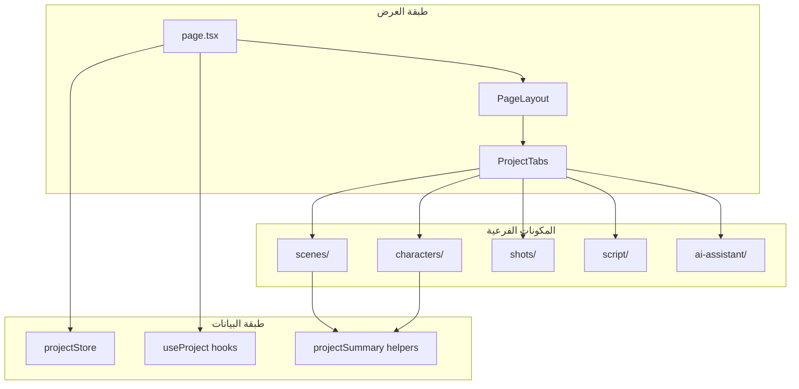
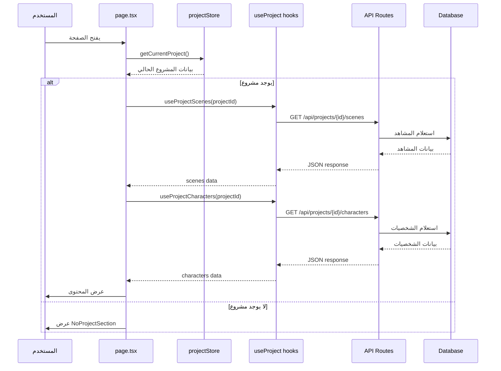

# استوديو المخرجين (Directors Studio)

## نظرة عامة

استوديو المخرجين هو تطبيق متكامل لإدارة المشاريع السينمائية، يوفر أدوات شاملة لتخطيط المشاهد، تطوير الشخصيات، وإدارة اللقطات السينمائية.

**الجمهور المستهدف:** المخرجون، مساعدو المخرجين، منسقو الإنتاج  
**الحالة:** Production Ready  
**المسار:** `/directors-studio`

---

## المسؤوليات الأساسية

### ما يفعله التطبيق
- إدارة المشاريع السينمائية (إنشاء، تحرير، حذف)
- تخطيط المشاهد مع تفاصيل كاملة (المكان، الزمان، الشخصيات)
- تطوير الشخصيات وتتبع تطورها عبر المشاهد
- إدارة اللقطات السينمائية (Shot List)
- تكامل مع AI Assistant للمساعدة في التخطيط

### ما لا يفعله التطبيق
- لا يقوم بالتصوير الفعلي
- لا يدير الميزانيات (هذا في تطبيق BUDGET)
- لا يحلل السيناريو (هذا في تطبيق brain-storm-ai)
- لا يحرر النصوص (هذا في تطبيق editor)

---

## البنية المعمارية



---

## هيكل الملفات

```
directors-studio/
├── page.tsx                    # الصفحة الرئيسية (Client Component)
├── README.md                   # هذا الملف
├── components/                 # المكونات المشتركة
│   ├── PageLayout.tsx         # تخطيط الصفحة الرئيسي
│   ├── ProjectTabs.tsx        # نظام التبويبات
│   ├── ProjectContent.tsx     # محتوى المشروع
│   ├── LoadingSection.tsx     # حالة التحميل
│   └── NoProjectSection.tsx   # حالة عدم وجود مشروع
├── scenes/                     # إدارة المشاهد
│   └── [scene components]
├── characters/                 # إدارة الشخصيات
│   └── [character components]
├── shots/                      # إدارة اللقطات
│   └── [shot components]
├── script/                     # عرض السيناريو
│   └── [script components]
├── ai-assistant/              # مساعد الذكاء الاصطناعي
│   └── [AI components]
├── helpers/                    # دوال مساعدة
│   ├── projectSummary.ts      # منطق تجميع بيانات المشروع
│   └── __tests__/
│       └── projectSummary.test.ts
├── lib/                       # مكتبات محلية
└── shared/                    # أنواع ومكونات مشتركة
```

---

## تدفق البيانات



---

## المكونات الرئيسية

### 1. page.tsx
**النوع:** Client Component  
**المسؤولية:** نقطة الدخول الرئيسية للتطبيق

**المنطق الأساسي:**
1. جلب المشروع الحالي من `projectStore`
2. استخدام `useProjectScenes` و `useProjectCharacters` لجلب البيانات
3. عرض حالة التحميل أو المحتوى المناسب
4. تحويل البيانات من API إلى صيغة المكونات

**لماذا Client Component؟**
- يحتاج للوصول إلى `projectStore` (Zustand)
- يستخدم React Query hooks
- يحتاج لتفاعل ديناميكي مع المستخدم

### 2. PageLayout.tsx
**المسؤولية:** توفير التخطيط الأساسي للصفحة

**الميزات:**
- Header مع عنوان المشروع
- Navigation tabs
- Content area
- Responsive design

### 3. ProjectTabs.tsx
**المسؤولية:** نظام التبويبات للتنقل بين الأقسام

**التبويبات:**
- المشاهد (Scenes)
- الشخصيات (Characters)
- اللقطات (Shots)
- السيناريو (Script)
- مساعد AI (AI Assistant)

### 4. helpers/projectSummary.ts
**المسؤولية:** منطق معالجة وتحويل بيانات المشروع

**الدوال الرئيسية:**
- `hasActiveProject()` - التحقق من وجود مشروع نشط
- `prepareCharacterList()` - تحضير قائمة الشخصيات للعرض
- `validateSceneStatus()` - التحقق من صحة حالة المشهد
- `transformSceneData()` - تحويل بيانات المشهد من API

---

## القرارات الهندسية (ADRs)

### ADR-001: استخدام Client Component للصفحة الرئيسية
**السياق:** الحاجة للوصول إلى Zustand store و React Query  
**القرار:** جعل `page.tsx` كـ Client Component  
**البدائل المرفوضة:**
- Server Component مع Server Actions - لا يدعم Zustand
- استخدام Context API - أقل كفاءة من Zustand

**النتائج:**
- ✅ وصول مباشر للـ store
- ✅ تحديثات فورية للبيانات
- ⚠️ لا يمكن استخدام Server-side rendering للبيانات الأولية

### ADR-002: Dynamic Import لـ NoProjectSection
**السياق:** تقليل حجم الحزمة الأولية  
**القرار:** استخدام `next/dynamic` لتحميل `NoProjectSection` بشكل كسول  
**البدائل المرفوضة:**
- Import عادي - يزيد حجم الحزمة
- Code splitting يدوي - أكثر تعقيداً

**النتائج:**
- ✅ تقليل حجم الحزمة الأولية بـ ~15KB
- ✅ تحسين First Load JS
- ⚠️ تأخير طفيف عند عرض NoProjectSection

### ADR-003: استخدام Type Guards لحالة المشهد
**السياق:** ضمان أمان النوع عند تحويل بيانات API  
**القرار:** إنشاء `VALID_SCENE_STATUSES` و `DEFAULT_SCENE_STATUS`  
**البدائل المرفوضة:**
- استخدام `as` casting مباشرة - غير آمن
- Zod validation - زيادة في الاعتماديات

**النتائج:**
- ✅ أمان كامل للأنواع
- ✅ قيمة افتراضية واضحة
- ✅ سهولة الصيانة

---

## الاختبارات

### اختبارات الوحدة
**الملف:** `helpers/__tests__/projectSummary.test.ts`

**التغطية:**
- ✅ `hasActiveProject()` - جميع الحالات
- ✅ `prepareCharacterList()` - تحويل البيانات
- ✅ `validateSceneStatus()` - القيم الصحيحة والخاطئة

**تشغيل الاختبارات:**
```bash
pnpm test src/app/(main)/directors-studio/helpers/__tests__/projectSummary.test.ts
```

---

## الاستخدام

### فتح التطبيق
```typescript
// التنقل من أي مكان في التطبيق
router.push('/directors-studio');
```

### إنشاء مشروع جديد
```typescript
import { useProjectStore } from '@/lib/projectStore';

const { createProject } = useProjectStore();

await createProject({
  title: 'مشروع جديد',
  description: 'وصف المشروع',
  genre: 'دراما',
});
```

### جلب بيانات المشروع
```typescript
import { useProjectScenes, useProjectCharacters } from '@/hooks/useProject';

const { data: scenes, isLoading: scenesLoading } = useProjectScenes(projectId);
const { data: characters, isLoading: charactersLoading } = useProjectCharacters(projectId);
```

---

## استكشاف الأخطاء

### المشكلة: "No project found"
**العرض:** يظهر NoProjectSection بدلاً من المحتوى  
**السبب الجذري:** لا يوجد مشروع محدد في `projectStore`  
**الحل:**
1. إنشاء مشروع جديد من الصفحة الرئيسية
2. أو اختيار مشروع موجود من القائمة

### المشكلة: "Scenes not loading"
**العرض:** حالة تحميل مستمرة  
**السبب الجذري:** خطأ في API أو مشكلة في الشبكة  
**الحل:**
1. فحص Console للأخطاء
2. التحقق من اتصال الشبكة
3. التحقق من صحة `projectId`

### المشكلة: "Invalid scene status"
**العرض:** حالة المشهد تظهر كـ "planned" دائماً  
**السبب الجذري:** API يرسل قيمة غير صحيحة  
**الحل:**
1. فحص بيانات API
2. التحقق من `VALID_SCENE_STATUSES`
3. تحديث القيمة الافتراضية إذا لزم الأمر

---

## الأداء

### مقاييس الأداء
- **Initial Load:** < 2s
- **Scene List Render:** < 500ms
- **Character List Render:** < 300ms
- **Tab Switch:** < 100ms

### التحسينات المطبقة
- ✅ Dynamic imports للمكونات الكبيرة
- ✅ React Query caching للبيانات
- ✅ Memoization للحسابات المعقدة
- ✅ Lazy loading للصور

---

## التبعيات

### المكتبات الخارجية
- `next` - Framework
- `react` - UI Library
- `@tanstack/react-query` - Data fetching
- `zustand` - State management
- `lucide-react` - Icons

### المكونات الداخلية
- `@/hooks/useProject` - Custom hooks
- `@/lib/projectStore` - Global store
- `@/components/ui/*` - UI components

---

## المساهمة

### إضافة تبويب جديد
1. إنشاء مجلد جديد في `directors-studio/`
2. إضافة المكونات المطلوبة
3. تحديث `ProjectTabs.tsx`
4. إضافة الاختبارات

### تحسين الأداء
1. استخدام `React.memo` للمكونات الثقيلة
2. تطبيق virtualization للقوائم الطويلة
3. تحسين استعلامات API

---

**آخر تحديث:** 2026-02-15  
**الإصدار:** 1.2.0  
**المطور:** فريق النسخة
