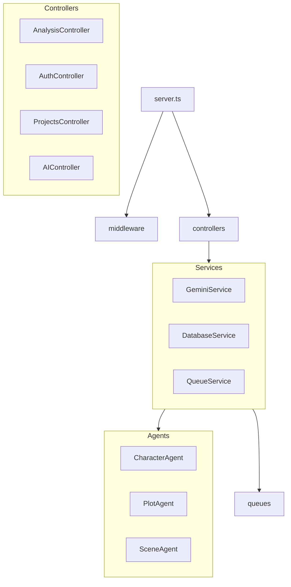

# هيكلة الواجهة الخلفية - النسخة (The Copy)

**المشروع:** backend (Express + TypeScript)
**المسار:** `backend/src/`

## البنية الأساسية

يتبع الخادم الخلفي معمارية MVC المحسنة للخدمات المصغرة (Service-Oriented).

| المجلد | المسؤولية | المحتويات الرئيسية |
|--------|-----------|--------------------|
| `agents/` | وكلاء الذكاء الاصطناعي | منطق الوكلاء (Character, Plot, etc.) |
| `controllers/` | وحدات التحكم | معالجة طلبات HTTP وتوجيهها للخدمات |
| `middleware/` | البرمجيات الوسيطة | المصادقة، الأمان، المراقبة، WAF |
| `queues/` | طوابير المهام | معالجة الخلفية (BullMQ) |
| `services/` | خدمات الأعمال | المنطق التجاري، التكامل الخارجي |
| `utils/` | الأدوات المساعدة | Logger, Helpers |
| `config/` | الإعدادات | Environment, Database, Sentry |

## المخطط الهيكلي

## نقاط الدخول

- `src/server.ts`: نقطة دخول خادم Express API.
- `src/mcp-server.ts`: خادم MCP (Model Context Protocol) للتكامل مع نماذج AI.

## الخدمات الرئيسية

1. **Gemini Service:** التعامل مع Google Gemini API.
2. **WebSocket Service:** للاتصال في الوقت الفعلي.
3. **SSE Service:** للأحداث المرسلة من الخادم (Server-Sent Events).
4. **Queue Service:** إدارة مهام الخلفية الطويلة.

## الأمان

- **WAF Middleware:** جدار حماية التطبيق.
- **CSRF Protection:** حماية من تزوير الطلبات.
- **Rate Limiting:** تحديد معدل الطلبات.
- **Auth Middleware:** التحقق من الهوية (JWT/Session).
