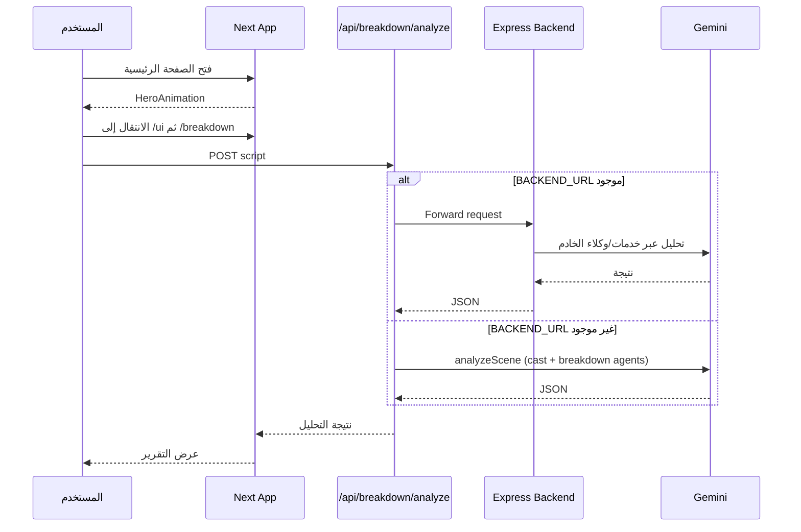
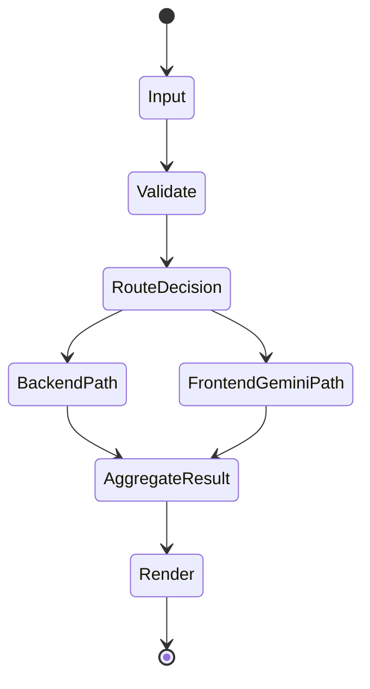

# آلية العمل الأساسية - النسخة (The Copy)

**تاريخ التحديث:** 2026-02-15  
**المشروع:** `the-copy-monorepo`

---

## ملخص تنفيذي

المستودع عبارة عن Monorepo فيه واجهة Next.js 16 وخادم Express منفصل. نقطة بداية المستخدم هي `frontend/src/app/layout.tsx` ثم `frontend/src/app/page.tsx`، وبعد اختيار التطبيق المناسب يتم تنفيذ التحليل عبر Next API Route (`/api/breakdown/analyze`) التي تشتغل كـ Proxy للـ Backend لو `BACKEND_URL` متاح، أو تنفذ التحليل مباشرة عبر Gemini داخل الواجهة لو الـ Backend غير متاح.

---

## تشخيص السبب الجذري للمشكلة في الوثائق

**السلوك الملحوظ:** ملفات التوثيق كانت تحتوي على `<<<<<<<`, `=======`, `>>>>>>>`.  
**السلوك المتوقع:** الوثائق تبقى نص واحد متماسك يعكس التنفيذ الفعلي.  
**مكان الفشل:** الملف نفسه بعد عملية merge غير مكتملة.  
**سبب الفشل:** تعارض دمج اتساب بدون resolve نهائي، فدخلت نسختين متضاربتين جوه نفس المستند.

---

## مسار التنفيذ الرئيسي (فعلي)

---

## دورة حياة البيانات

---

## الطبقات المعمارية

| الطبقة | المسؤولية | ملفات أساسية | المدخلات | المخرجات |
|---|---|---|---|---|
| العرض | UI وNavigation | `frontend/src/app/page.tsx`, `frontend/src/app/ui/page.tsx` | تفاعل المستخدم | طلب تحليل |
| مزودات التطبيق | State/Tracing/Notifications | `frontend/src/app/providers.tsx` | شجرة React | Providers مفعلة |
| API في الواجهة | قرار المسار (Proxy أو تنفيذ مباشر) | `frontend/src/app/api/breakdown/analyze/route.ts` | script | JSON نتيجة |
| خدمة التحليل في الواجهة | تحليل المشهد وتشغيل وكلاء breakdown | `frontend/src/app/(main)/breakdown/services/geminiService.ts`, `breakdownAgents.ts` | scene النصي | SceneBreakdown |
| الخادم الخلفي | Auth + Security + Routing + Controllers | `backend/src/server.ts` | HTTP requests | JSON/API responses |
| نظام الوكلاء في الخادم | تسجيل وتشغيل 27 وكيل + Orchestration/Debate | `backend/src/services/agents/registry.ts`, `orchestrator.ts` | fullText + task types | نتائج تحليل مركبة |

---

## القرارات المعمارية الجوهرية

### ADR-001: Dual-path analysis (Backend Proxy / Direct Gemini)
**السياق:** التطبيق لازم يشتغل حتى لو الـ backend مش متاح محليًا.  
**القرار:** route في Next تختار بين Proxy وGemini direct حسب `BACKEND_URL`.  
**البدائل:** ربط إجباري بالـ backend فقط.  
**النتيجة:** مرونة أعلى للتطوير السريع، مع تعقيد بسيط في مسار التنفيذ.

### ADR-002: Registry + Orchestrator للوكلاء
**السياق:** عدد الوكلاء كبير (27 وكيل) ومحتاج إدارة مركزية.  
**القرار:** استخدام `AgentRegistry` + `MultiAgentOrchestrator`.  
**البدائل:** استدعاء يدوي مباشر لكل وكيل داخل controllers.  
**النتيجة:** قابلية توسع أعلى وإدارة أوضح لتشغيل متوازي/تسلسلي والمناظرات.

### ADR-003: Security-first middleware chain في الخادم
**السياق:** API فيها عمليات state-changing حساسة.  
**القرار:** ترتيب middleware مبكر للحماية (WAF, CSRF, auth logging, metrics).  
**البدائل:** تطبيق حماية متفرقة داخل كل route.  
**النتيجة:** توحيد الحماية وتقليل فرص نسيان التحقق في endpoint جديد.

---

## نقاط التكامل الخارجية

- **Gemini API** للتحليل النصي.
- **Redis/BullMQ** للمهام الخلفية في الخادم.
- **Sentry + OpenTelemetry** للمراقبة.
- **PostgreSQL/Neon** كقاعدة بيانات (حسب الإعدادات).

---

## ملفات الاستدلال الأساسية

- `frontend/src/app/layout.tsx`
- `frontend/src/app/page.tsx`
- `frontend/src/app/ui/page.tsx`
- `frontend/src/app/api/breakdown/analyze/route.ts`
- `frontend/src/app/(main)/breakdown/services/geminiService.ts`
- `backend/src/server.ts`
- `backend/src/services/agents/registry.ts`
- `backend/src/services/agents/orchestrator.ts`

---

**آخر تحديث:** 2026-02-15
