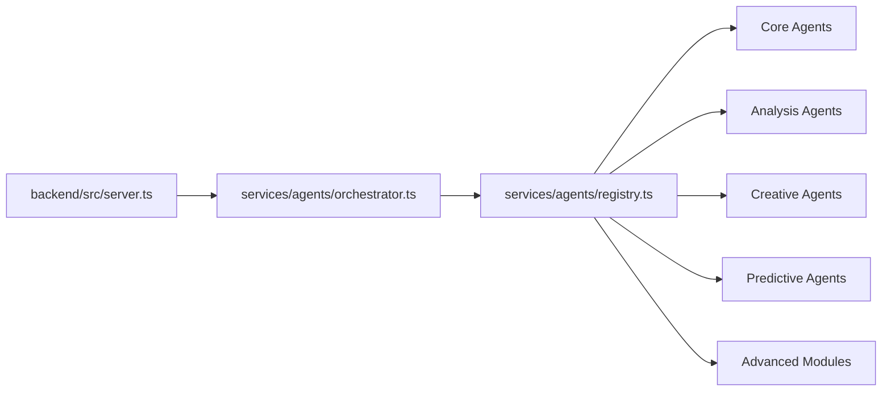
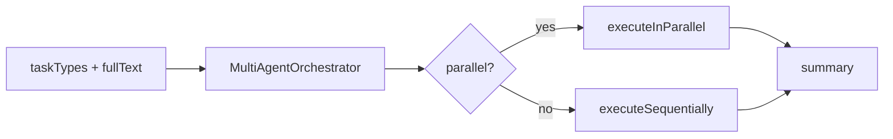

# علاقات الملفات - النسخة (The Copy)

**تاريخ التحديث:** 2026-02-15  
**المشروع:** `the-copy-monorepo`

---

## 1) تشخيص السبب الجذري قبل الإصلاح

**السلوك الملحوظ:** الملف كان متضرر وناقص ومفيهوش هيكل Markdown كامل بعد محاولة حل تعارض دمج.  
**السلوك المتوقع:** وثيقة واحدة سليمة، كل الرسومات مقفولة ومترابطة.  
**مكان الفشل:** `docs/FILE_RELATIONS.md`.  
**سبب الفشل:** دمج غير مكتمل نتج عنه حذف جزء من بداية الملف وكسر بناء الأقسام.

---

## 2) تبعيات المجلدات (مستوى عالٍ)

```mermaid
graph TD
    APP[frontend/src/app] --> CMP[frontend/src/components]
    APP --> CFG[frontend/src/config]
    APP --> API[frontend/src/app/api]

    API --> BRS[frontend/src/app/(main)/breakdown/services]
    BRS --> FBA[frontend breakdown agents]
    BRS --> GEM[@google/genai]

    API --> BE[backend/src/server.ts]
    BE --> CTL[backend/src/controllers]
    BE --> MID[backend/src/middleware]
    CTL --> ORC[backend/src/services/agents/orchestrator.ts]
    ORC --> REG[backend/src/services/agents/registry.ts]
    REG --> AGT[27 backend agents]
```

---

## 3) علاقات ملفات فعلية (Frontend Entry)

```mermaid
graph LR
    L[frontend/src/app/layout.tsx] --> P[frontend/src/app/providers.tsx]
    HP[frontend/src/app/page.tsx] --> H[@/components/HeroAnimation]
    UI[frontend/src/app/ui/page.tsx] --> LC[@/components/LauncherCenterCard]
    UI --> AC[@/config/apps.config]
```

---

## 4) علاقات ملفات فعلية (Breakdown Flow)

```mermaid
graph LR
    R[app/api/breakdown/analyze/route.ts] --> GS[app/(main)/breakdown/services/geminiService.ts]
    GS --> CS[castService.ts]
    GS --> BO[breakdownAgents.ts]

    BO --> C1[costumeAgent.ts]
    BO --> C2[makeupHairAgent.ts]
    BO --> C3[graphicsAgent.ts]
    BO --> C4[vehiclesAgent.ts]
    BO --> C5[locationsAgent.ts]
    BO --> C6[extrasAgent.ts]
    BO --> C7[propsAgent.ts]
    BO --> C8[stuntsAgent.ts]
    BO --> C9[animalsAgent.ts]
    BO --> C10[spfxAgent.ts]
    BO --> C11[vfxAgent.ts]
```

---

## 5) علاقات ملفات فعلية (Backend Agent System)



---

## 6) سيناريوهات تدفق البيانات الرئيسية

### سيناريو 1: تحليل Breakdown (Dual Path)

```mermaid
flowchart LR
    A[المستخدم يرسل script] --> B[/api/breakdown/analyze]
    B --> C{BACKEND_URL موجود؟}
    C -->|نعم| D[Proxy إلى backend]
    C -->|لا| E[analyzeScene محلياً]
    D --> F[نتيجة]
    E --> F
    F --> G[عرض التقرير]
```

### سيناريو 2: تشغيل تطبيق من Launcher

```mermaid
flowchart LR
    A[/ui] --> B[getEnabledApps]
    B --> C[render app cards]
    C --> D[navigate to selected app]
```

### سيناريو 3: تشغيل Orchestrator في الخادم



---

## 7) ملاحظات دقة

- العلاقات هنا مبنية على ملفات فعلية تمت قراءتها، مش افتراضات عامة.
- تم استبعاد أي علاقة غير مؤكدة باستيراد مباشر.

---

**آخر تحديث:** 2026-02-15
