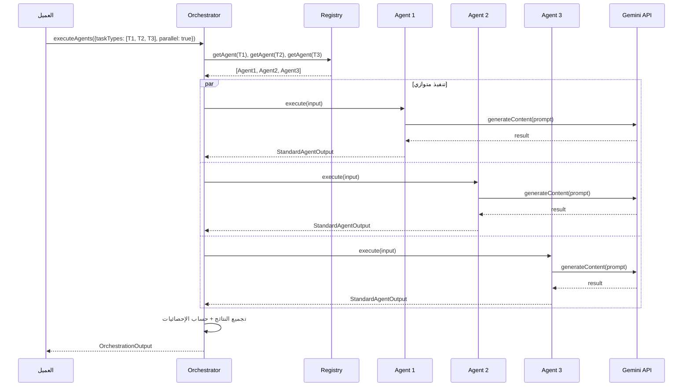
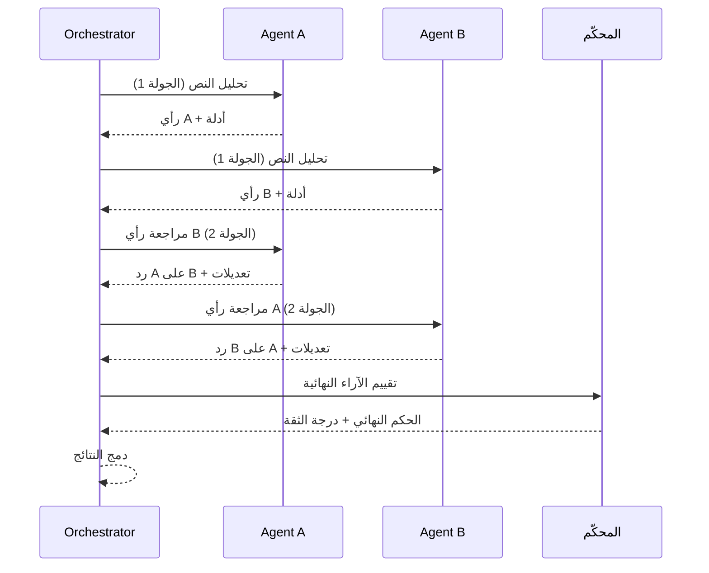
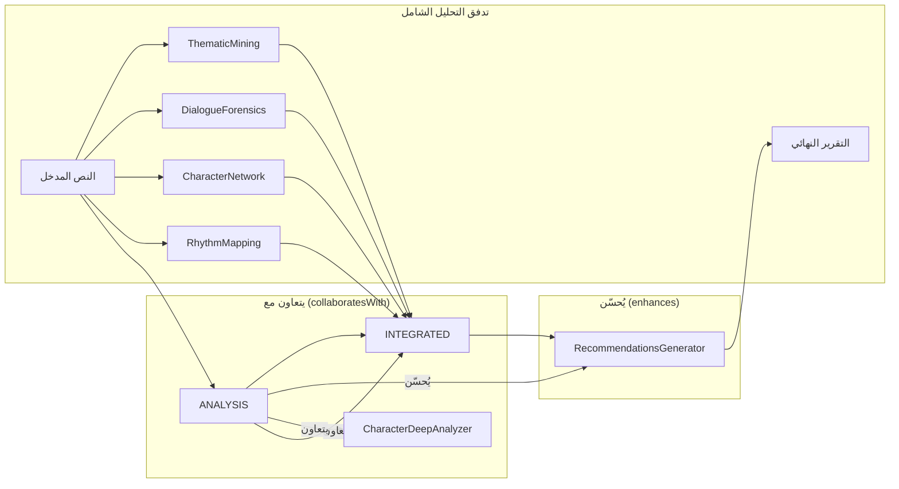
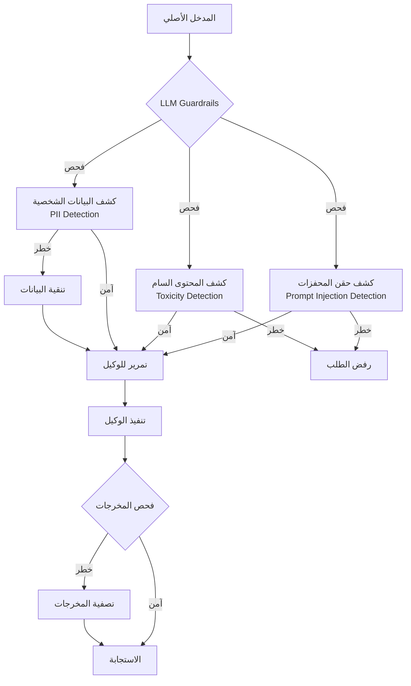

# توثيق نظام وكلاء الذكاء الاصطناعي — النسخة

**المسارات:**
- Backend: `backend/src/agents/` + `backend/src/services/agents/`
- Frontend: `frontend/src/lib/drama-analyst/agents/`

---

## 1. نظرة عامة

نظام الوكلاء في "النسخة" يتكون من **27 وكيل ذكاء اصطناعي** مُسجّلين في `AgentRegistry` (Singleton)، مقسمين إلى 4 فئات رئيسية. كل وكيل يرث من `BaseAgent` ويتصل بـ Google Gemini AI عبر `GeminiService`.

النظام يدعم:
- **تنفيذ متوازٍ أو متتابع** عبر `MultiAgentOrchestrator`
- **نظام مناظرات (Debate System)** لتحسين دقة التحليل
- **سير عمل معقد (Workflow Executor)** مع شروط وتفرعات
- **تخزين مؤقت تكيفي** لتقليل استدعاءات Gemini API
- **حواجز أمان LLM** لمنع حقن المحفزات (Prompt Injection)

---

## 2. المعمارية العامة

```mermaid
graph TB
    subgraph "طبقة التنسيق (Orchestration)"
        ORCH[MultiAgentOrchestrator<br/>Singleton — تنفيذ متوازي/متتابع]
        DEBATE[Debate System<br/>مناظرات بين الوكلاء]
        WF[Workflow Executor<br/>سير عمل معقد]
        PRESETS[Workflow Presets<br/>قوالب جاهزة]
    end

    subgraph "طبقة التسجيل (Registry)"
        REG[AgentRegistry<br/>Singleton — 27 وكيل مُسجّل]
    end

    subgraph "الوكلاء الأساسيون (Core — 4)"
        C1[Analysis Agent<br/>CritiqueArchitect AI]
        C2[Creative Agent<br/>الوكيل الإبداعي]
        C3[Integrated Agent<br/>الوكيل المتكامل]
        C4[Completion Agent<br/>وكيل الإكمال]
    end

    subgraph "وكلاء التحليل (Analysis — 6)"
        A1[RhythmMapping<br/>خرائط الإيقاع]
        A2[CharacterNetwork<br/>شبكة الشخصيات]
        A3[DialogueForensics<br/>تحليل الحوار الجنائي]
        A4[ThematicMining<br/>استخراج المواضيع]
        A5[StyleFingerprint<br/>بصمة الأسلوب]
        A6[ConflictDynamics<br/>ديناميكيات الصراع]
    end

    subgraph "الوكلاء الإبداعيون (Creative — 4)"
        CR1[AdaptiveRewriting<br/>إعادة الكتابة التكيفية]
        CR2[SceneGenerator<br/>مولد المشاهد]
        CR3[CharacterVoice<br/>صوت الشخصية]
        CR4[WorldBuilder<br/>باني العوالم]
    end

    subgraph "الوكلاء التنبؤيون (Predictive — 4)"
        P1[PlotPredictor<br/>متنبئ الحبكة]
        P2[TensionOptimizer<br/>محسن التوتر]
        P3[AudienceResonance<br/>صدى الجمهور]
        P4[PlatformAdapter<br/>محول المنصات]
    end

    subgraph "الوحدات المتقدمة (Advanced — 9)"
        AD1[CharacterDeepAnalyzer<br/>تحليل الشخصيات العميق]
        AD2[DialogueAdvancedAnalyzer<br/>تحليل الحوار المتقدم]
        AD3[VisualCinematicAnalyzer<br/>التحليل البصري السينمائي]
        AD4[ThemesMessagesAnalyzer<br/>المواضيع والرسائل]
        AD5[CulturalHistoricalAnalyzer<br/>التحليل الثقافي والتاريخي]
        AD6[ProducibilityAnalyzer<br/>قابلية الإنتاج]
        AD7[TargetAudienceAnalyzer<br/>الجمهور المستهدف]
        AD8[LiteraryQualityAnalyzer<br/>الجودة الأدبية]
        AD9[RecommendationsGenerator<br/>مولد التوصيات]
    end

    subgraph "البنية التحتية (Infrastructure)"
        BASE[BaseAgent<br/>الكلاس الأساسي]
        GEM[GeminiService<br/>تكامل Gemini API]
        GUARD[LLM Guardrails<br/>حواجز الأمان]
        CACHE[Gemini Cache Strategy<br/>تخزين مؤقت تكيفي]
        COST[Cost Tracker<br/>تتبع التكاليف]
    end

    ORCH --> REG
    ORCH --> DEBATE & WF
    WF --> PRESETS
    REG --> C1 & C2 & C3 & C4
    REG --> A1 & A2 & A3 & A4 & A5 & A6
    REG --> CR1 & CR2 & CR3 & CR4
    REG --> P1 & P2 & P3 & P4
    REG --> AD1 & AD2 & AD3 & AD4 & AD5 & AD6 & AD7 & AD8 & AD9

    C1 & C2 & C3 & C4 --> BASE
    A1 & A2 & A3 & A4 & A5 & A6 --> BASE
    BASE --> GEM --> GUARD & CACHE & COST
```



---

## 3. جدول الوكلاء الكامل (27 وكيل)

### 3.1 الوكلاء الأساسيون (Core — 4)

| # | الوكيل | TaskType | الاسم العربي | الوصف | الحرارة (Temperature) |
|---|--------|----------|-------------|-------|----------------------|
| 1 | **CritiqueArchitect AI** | `ANALYSIS` | محلل السيناريو | تحليل نقدي معماري — تفكيك جدلي + تحليل شعاعي عميق | 0.3 |
| 2 | **Creative Agent** | `CREATIVE` | الوكيل الإبداعي | توليد محتوى إبداعي وأفكار جديدة | — |
| 3 | **Integrated Agent** | `INTEGRATED` | الوكيل المتكامل | تحليل شامل يدمج عدة زوايا | — |
| 4 | **Completion Agent** | `COMPLETION` | وكيل الإكمال | إكمال النصوص والسيناريوهات الناقصة | — |

### 3.2 وكلاء التحليل (Analysis — 6)

| # | الوكيل | TaskType | الوصف |
|---|--------|----------|-------|
| 5 | **RhythmMapping** | `RHYTHM_MAPPING` | رسم خرائط الإيقاع الدرامي — تحليل التوقيت والتناوب بين المشاهد |
| 6 | **CharacterNetwork** | `CHARACTER_NETWORK` | تحليل شبكة العلاقات بين الشخصيات — العقد والروابط والتأثير |
| 7 | **DialogueForensics** | `DIALOGUE_FORENSICS` | التحليل الجنائي للحوار — أنماط الكلام، التكرار، الدلالات المخفية |
| 8 | **ThematicMining** | `THEMATIC_MINING` | استخراج المواضيع — كشف الأنماط الموضوعية والرمزية |
| 9 | **StyleFingerprint** | `STYLE_FINGERPRINT` | بصمة الأسلوب — تحليل الأسلوب الأدبي والسينمائي الفريد |
| 10 | **ConflictDynamics** | `CONFLICT_DYNAMICS` | ديناميكيات الصراع — تحليل بنية الصراعات وتطورها |

### 3.3 الوكلاء الإبداعيون (Creative — 4)

| # | الوكيل | TaskType | الوصف |
|---|--------|----------|-------|
| 11 | **AdaptiveRewriting** | `ADAPTIVE_REWRITING` | إعادة كتابة تكيفية — تحسين النص مع الحفاظ على الروح الأصلية |
| 12 | **SceneGenerator** | `SCENE_GENERATOR` | مولد المشاهد — إنشاء مشاهد جديدة بناءً على السياق |
| 13 | **CharacterVoice** | `CHARACTER_VOICE` | صوت الشخصية — توليد حوارات بأسلوب شخصية محددة |
| 14 | **WorldBuilder** | `WORLD_BUILDER` | باني العوالم — بناء عوالم درامية متكاملة |

### 3.4 الوكلاء التنبؤيون (Predictive — 4)

| # | الوكيل | TaskType | الوصف |
|---|--------|----------|-------|
| 15 | **PlotPredictor** | `PLOT_PREDICTOR` | التنبؤ بالحبكة — توقع تطورات القصة المحتملة |
| 16 | **TensionOptimizer** | `TENSION_OPTIMIZER` | محسن التوتر — تحسين منحنى التوتر الدرامي |
| 17 | **AudienceResonance** | `AUDIENCE_RESONANCE` | صدى الجمهور — تقييم التأثير العاطفي على المشاهدين |
| 18 | **PlatformAdapter** | `PLATFORM_ADAPTER` | محول المنصات — تكييف النص لمنصات مختلفة (سينما، تلفزيون، مسرح) |

### 3.5 الوحدات المتقدمة (Advanced — 9)

| # | الوكيل | TaskType | الوصف |
|---|--------|----------|-------|
| 19 | **CharacterDeepAnalyzer** | `CHARACTER_DEEP_ANALYZER` | تحليل نفسي عميق للشخصيات — الدوافع، التحولات، الأبعاد |
| 20 | **DialogueAdvancedAnalyzer** | `DIALOGUE_ADVANCED_ANALYZER` | تحليل حوار متقدم — البلاغة، الإيقاع، النبرة |
| 21 | **VisualCinematicAnalyzer** | `VISUAL_CINEMATIC_ANALYZER` | تحليل بصري سينمائي — الإضاءة، الزوايا، التكوين |
| 22 | **ThemesMessagesAnalyzer** | `THEMES_MESSAGES_ANALYZER` | تحليل المواضيع والرسائل — الرسائل الضمنية والصريحة |
| 23 | **CulturalHistoricalAnalyzer** | `CULTURAL_HISTORICAL_ANALYZER` | تحليل ثقافي وتاريخي — السياق الثقافي والدقة التاريخية |
| 24 | **ProducibilityAnalyzer** | `PRODUCIBILITY_ANALYZER` | تحليل قابلية الإنتاج — الجدوى التقنية والمالية |
| 25 | **TargetAudienceAnalyzer** | `TARGET_AUDIENCE_ANALYZER` | تحليل الجمهور المستهدف — الديموغرافيا والتفضيلات |
| 26 | **LiteraryQualityAnalyzer** | `LITERARY_QUALITY_ANALYZER` | تحليل الجودة الأدبية — اللغة، البنية، الأصالة |
| 27 | **RecommendationsGenerator** | `RECOMMENDATIONS_GENERATOR` | مولد التوصيات — توصيات عملية قابلة للتنفيذ |

---

## 4. بنية الوكيل (Agent Architecture)

### 4.1 الكلاس الأساسي `BaseAgent`

كل وكيل يرث من `BaseAgent` ويحتوي على:

```
BaseAgent
├── config: AIAgentConfig          # إعدادات الوكيل
│   ├── id: string                 # معرّف فريد (TaskType)
│   ├── name: string               # اسم الوكيل
│   ├── description: string        # وصف تفصيلي
│   ├── category: TaskCategory     # الفئة (CORE/ANALYSIS/CREATIVE/PREDICTIVE)
│   ├── capabilities: object       # القدرات (multiModal, reasoningChains, etc.)
│   ├── modelConfig: object        # إعدادات النموذج (temperature, maxTokens, etc.)
│   ├── systemPrompt: string       # المحفز النظامي (System Prompt)
│   ├── qualityGates: string[]     # بوابات الجودة
│   ├── confidenceThreshold: number # حد الثقة الأدنى
│   ├── collaboratesWith: TaskType[] # وكلاء يتعاون معهم
│   ├── dependsOn: TaskType[]      # وكلاء يعتمد عليهم
│   └── enhances: TaskType[]       # وكلاء يُحسّن نتائجهم
│
├── execute(input): Promise<StandardAgentOutput>  # تنفيذ المهمة
├── validate(output): boolean                     # التحقق من جودة المخرجات
└── getMetadata(): AgentMetadata                  # بيانات وصفية
```

### 4.2 إعدادات النموذج (AIAgentConfig.capabilities)

```typescript
interface AgentCapabilities {
  multiModal: boolean;          // دعم الوسائط المتعددة
  reasoningChains: boolean;     // سلاسل الاستدلال
  toolUse: boolean;             // استخدام الأدوات
  memorySystem: boolean;        // نظام الذاكرة
  selfReflection: boolean;      // التفكير الذاتي
  ragEnabled: boolean;          // RAG مفعّل
  vectorSearch: boolean;        // بحث متجهي
  agentOrchestration: boolean;  // تنسيق الوكلاء
  metacognitive: boolean;       // ما وراء المعرفة
  adaptiveLearning: boolean;    // تعلم تكيفي
  emotionalIntelligence: boolean; // ذكاء عاطفي
  criticalAnalysis: boolean;    // تحليل نقدي
  creativeGeneration: boolean;  // توليد إبداعي
  temporalReasoning: boolean;   // استدلال زمني
  causalReasoning: boolean;     // استدلال سببي
  analogicalReasoning: boolean; // استدلال تناظري
}
```

---

## 5. مسار التنفيذ

### 5.1 التنفيذ المتوازي



### 5.2 نظام المناظرات (Debate System)



---

## 6. العلاقات بين الوكلاء



---

## 7. وكلاء الـ Frontend (drama-analyst)

بالإضافة لوكلاء الـ Backend، يحتوي الـ Frontend على نظام وكلاء مستقل في `frontend/src/lib/drama-analyst/`:

```
drama-analyst/
├── index.ts                    # تصدير مركزي
├── config.ts                   # إعدادات النظام
├── constants.ts                # ثوابت
├── enums.ts                    # تعدادات (TaskType, etc.)
├── types.ts                    # أنواع TypeScript
│
├── agents/                     # وكلاء التحليل
│   ├── adaptiveRewriting/      # إعادة الكتابة التكيفية
│   ├── analysis/               # التحليل العام
│   ├── audienceResonance/      # صدى الجمهور
│   ├── characterDeepAnalyzer/  # تحليل الشخصيات العميق
│   ├── characterNetwork/       # شبكة الشخصيات
│   ├── characterVoice/         # صوت الشخصية
│   ├── completion/             # الإكمال
│   ├── conflictDynamics/       # ديناميكيات الصراع
│   ├── creative/               # الإبداعي
│   ├── culturalHistoricalAnalyzer/
│   ├── dialogueAdvancedAnalyzer/
│   ├── dialogueForensics/
│   ├── integrated/             # المتكامل
│   ├── literaryQualityAnalyzer/
│   ├── platformAdapter/
│   ├── plotPredictor/
│   └── ... (المزيد)
│
├── orchestration/              # تنسيق الوكلاء
└── services/                   # خدمات التحليل
```

### الفرق بين وكلاء Backend و Frontend

| الجانب | Backend Agents | Frontend Agents |
|--------|---------------|-----------------|
| **المسار** | `backend/src/agents/` + `backend/src/services/agents/` | `frontend/src/lib/drama-analyst/agents/` |
| **التنفيذ** | Server-Side عبر Express API | Client-Side عبر Gemini API مباشرة |
| **الاستخدام** | تحليل المحطات السبع + API endpoints | تحليل فوري في المتصفح |
| **التخزين المؤقت** | Redis + استراتيجية تكيفية | React Query cache |
| **الحماية** | LLM Guardrails + Rate Limiting | Constitutional AI |
| **العدد** | 27 وكيل مُسجّل | 17+ وكيل |

---

## 8. إعدادات النموذج

### النموذج المستخدم
- **الاسم:** `gemini-2.0-flash-exp`
- **المزود:** Google Generative AI
- **Timeout:** 30 ثانية

### إعدادات افتراضية

| المعامل | القيمة | الوصف |
|---------|--------|-------|
| `temperature` | 0.3 (تحليل) — 0.7 (إبداع) | درجة العشوائية |
| `maxTokens` | 4000 | الحد الأقصى للتوكنات |
| `topP` | 0.9 | Nucleus Sampling |
| `frequencyPenalty` | 0.1 | عقوبة التكرار |
| `presencePenalty` | 0.1 | عقوبة الحضور |
| `confidenceThreshold` | 0.7 — 0.85 | حد الثقة الأدنى |

---

## 9. نظام الحماية (LLM Guardrails)



---

## 10. تتبع التكاليف (Cost Tracking)

- **تتبع التوكنات:** لكل استدعاء Gemini API يتم حساب `inputTokens` + `outputTokens`
- **ميزانية يومية:** `GEMINI_DAILY_COST_LIMIT` (افتراضي: $10)
- **ميزانية شهرية:** `GEMINI_MONTHLY_BUDGET` (افتراضي: $300)
- **تنبيهات:** عبر Slack Webhook أو البريد الإلكتروني عند تجاوز الحدود
- **API Endpoint:** `GET /api/gemini/cost-summary` (محمي — admin فقط)

---

**آخر تحديث:** 2026-02-15
