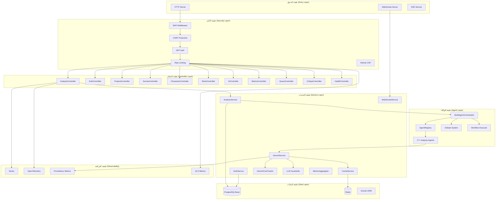
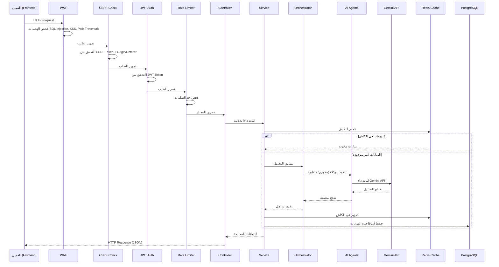
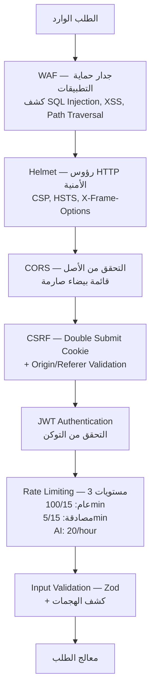
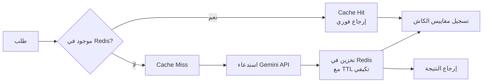

# توثيق الخادم الخلفي (Backend) — النسخة

**المسار:** `backend/`  
**النوع:** Express.js REST API + WebSocket + Background Jobs  
**اللغة:** TypeScript (ES2022, CommonJS)  
**نقطة الدخول:** `src/server.ts`

---

## 1. نظرة عامة

الخادم الخلفي هو واجهة برمجة تطبيقات (API) مبنية على Express.js 5 مع TypeScript، توفر:
- نظام مصادقة (Authentication) كامل مع JWT + Zero-Knowledge Auth
- تكامل مع Google Gemini AI لتحليل السيناريوهات الدرامية
- نظام وكلاء ذكاء اصطناعي متعدد (Multi-Agent Orchestrator) مع نظام مناظرات (Debate System)
- نظام طوابير خلفية (BullMQ) للمهام الثقيلة
- WebSocket + SSE للاتصال الفوري (Real-time)
- نظام مراقبة شامل (Sentry + OpenTelemetry + Prometheus)
- جدار حماية تطبيقات الويب (WAF)

---

## 2. البنية المعمارية



---

## 3. هيكل المجلدات

```
backend/
├── src/
│   ├── server.ts                    # نقطة الدخول الرئيسية — Express app + HTTP server
│   ├── mcp-server.ts                # خادم MCP (Model Context Protocol)
│   ├── env.d.ts                     # تعريفات أنواع متغيرات البيئة
│   ├── global.d.ts                  # تعريفات أنواع عامة
│   │
│   ├── config/                      # إعدادات النظام
│   │   ├── env.ts                   # تحقق Zod من متغيرات البيئة
│   │   ├── agents.ts                # إعدادات الوكلاء
│   │   ├── agentConfigs.ts          # تكوينات تفصيلية للوكلاء
│   │   ├── agentPrompts.ts          # محفزات (Prompts) الوكلاء
│   │   ├── redis.config.ts          # إعدادات Redis
│   │   ├── sentry.ts                # إعدادات Sentry
│   │   ├── tracing.ts               # إعدادات OpenTelemetry
│   │   ├── swagger.ts               # إعدادات Swagger/OpenAPI
│   │   ├── validate-env.ts          # تحقق إضافي من البيئة
│   │   └── websocket.config.ts      # إعدادات WebSocket
│   │
│   ├── controllers/                 # معالجات الطلبات (Request Handlers)
│   │   ├── analysis.controller.ts   # تحليل السيناريوهات (Seven Stations Pipeline)
│   │   ├── auth.controller.ts       # تسجيل الدخول/الخروج/التسجيل
│   │   ├── zkAuth.controller.ts     # مصادقة Zero-Knowledge
│   │   ├── projects.controller.ts   # إدارة المشاريع (CRUD + تحليل)
│   │   ├── scenes.controller.ts     # إدارة المشاهد
│   │   ├── characters.controller.ts # إدارة الشخصيات
│   │   ├── shots.controller.ts      # إدارة اللقطات + اقتراحات AI
│   │   ├── ai.controller.ts         # محادثة AI + اقتراحات اللقطات
│   │   ├── critique.controller.ts   # نظام النقد الذاتي المحسّن
│   │   ├── metrics.controller.ts    # لوحة المقاييس والمراقبة
│   │   ├── queue.controller.ts      # إدارة طوابير المهام
│   │   ├── health.controller.ts     # فحوصات الصحة (Liveness/Readiness/Startup)
│   │   ├── encryptedDocs.controller.ts # مستندات مشفرة (Zero-Knowledge)
│   │   ├── realtime.controller.ts   # أحداث الوقت الفعلي
│   │   └── workflow.controller.ts   # إدارة سير العمل
│   │
│   ├── middleware/                   # طبقات وسيطة (Middleware)
│   │   ├── index.ts                 # إعداد CORS + Helmet + Rate Limiting + Compression
│   │   ├── auth.middleware.ts       # التحقق من JWT tokens
│   │   ├── csrf.middleware.ts       # حماية CSRF (Double Submit Cookie)
│   │   ├── waf.middleware.ts        # جدار حماية تطبيقات الويب
│   │   ├── csp.middleware.ts        # Content Security Policy
│   │   ├── metrics.middleware.ts    # Prometheus metrics collection
│   │   ├── sentry.middleware.ts     # Sentry error/performance tracking
│   │   ├── slo-metrics.middleware.ts # SLO tracking (Availability, Latency, Error Budget)
│   │   ├── security-logger.middleware.ts # تسجيل أحداث الأمان
│   │   ├── log-sanitization.middleware.ts # تنقية السجلات من PII
│   │   ├── safe-logging.middleware.ts    # تسجيل آمن
│   │   ├── validation.middleware.ts      # تحقق Zod من المدخلات + كشف الهجمات
│   │   └── bull-board.middleware.ts      # لوحة مراقبة طوابير BullMQ
│   │
│   ├── services/                    # منطق الأعمال (Business Logic)
│   │   ├── gemini.service.ts        # تكامل Google Gemini AI مع caching + cost tracking
│   │   ├── analysis.service.ts      # خدمة التحليل الدرامي
│   │   ├── AnalysisService.ts       # خدمة تحليل إضافية
│   │   ├── auth.service.ts          # منطق المصادقة (JWT + bcrypt)
│   │   ├── cache.service.ts         # Redis caching layer
│   │   ├── cache-metrics.service.ts # مقاييس أداء الكاش
│   │   ├── gemini-cache.strategy.ts # استراتيجية تخزين مؤقت ذكية لـ Gemini
│   │   ├── gemini-cost-tracker.service.ts # تتبع تكاليف Gemini API
│   │   ├── llm-guardrails.service.ts     # حواجز أمان LLM (منع الحقن)
│   │   ├── metrics-aggregator.service.ts # تجميع المقاييس
│   │   ├── mfa.service.ts           # مصادقة متعددة العوامل (TOTP + QR)
│   │   ├── websocket.service.ts     # خدمة WebSocket (Socket.IO)
│   │   ├── sse.service.ts           # خدمة Server-Sent Events
│   │   ├── instructions-loader.ts   # تحميل تعليمات الوكلاء
│   │   ├── agent-instructions.ts    # تعليمات الوكلاء المركزية
│   │   │
│   │   ├── agents/                  # نظام الوكلاء المتقدم
│   │   │   ├── orchestrator.ts      # منسق الوكلاء المتعدد (Singleton)
│   │   │   ├── registry.ts          # سجل الوكلاء المتاحين
│   │   │   ├── taskInstructions.ts  # تعليمات المهام
│   │   │   ├── upgradedAgents.ts    # وكلاء محسّنون
│   │   │   ├── workflow-examples.ts # أمثلة سير العمل
│   │   │   └── index.ts            # تصدير مركزي
│   │   │
│   │   └── rag/                     # نظام RAG (Retrieval-Augmented Generation)
│   │
│   ├── agents/                      # وكلاء التحليل الدرامي
│   │   ├── analysis/                # وكلاء التحليل (17 وكيل)
│   │   │   ├── analysisAgent.ts              # الوكيل الرئيسي للتحليل
│   │   │   ├── characterDeepAnalyzerAgent.ts # محلل الشخصيات العميق
│   │   │   ├── characterNetworkAgent.ts      # شبكة العلاقات بين الشخصيات
│   │   │   ├── characterVoiceAgent.ts        # تحليل صوت الشخصية
│   │   │   ├── conflictDynamicsAgent.ts      # ديناميكيات الصراع
│   │   │   ├── culturalHistoricalAnalyzerAgent.ts # التحليل الثقافي والتاريخي
│   │   │   ├── dialogueAdvancedAnalyzerAgent.ts   # تحليل الحوار المتقدم
│   │   │   ├── dialogueForensicsAgent.ts     # التحليل الجنائي للحوار
│   │   │   ├── literaryQualityAnalyzerAgent.ts    # محلل الجودة الأدبية
│   │   │   ├── plotPredictorAgent.ts         # متنبئ الحبكة
│   │   │   ├── producibilityAnalyzerAgent.ts # محلل قابلية الإنتاج
│   │   │   ├── rhythmMappingAgent.ts         # خرائط الإيقاع الدرامي
│   │   │   ├── targetAudienceAnalyzerAgent.ts # محلل الجمهور المستهدف
│   │   │   ├── thematicMiningAgent.ts        # استخراج المواضيع
│   │   │   ├── themesMessagesAnalyzerAgent.ts # محلل المواضيع والرسائل
│   │   │   ├── visualCinematicAnalyzerAgent.ts # المحلل البصري السينمائي
│   │   │   └── config.ts                    # إعدادات مشتركة
│   │   │
│   │   ├── instructions/            # تعليمات الوكلاء (Prompts)
│   │   │   ├── analysis_instructions.ts
│   │   │   ├── character_deep_analyzer_instructions.ts
│   │   │   ├── character_network_instructions.ts
│   │   │   ├── character_voice_instructions.ts
│   │   │   ├── conflict_dynamics_instructions.ts
│   │   │   ├── cultural_historical_analyzer_instructions.ts
│   │   │   ├── dialogue_advanced_analyzer_instructions.ts
│   │   │   ├── dialogue_forensics_instructions.ts
│   │   │   ├── literary_quality_analyzer_instructions.ts
│   │   │   └── ... (المزيد من التعليمات)
│   │   │
│   │   └── transformation/          # وكلاء التحويل
│   │
│   ├── queues/                      # نظام طوابير المهام (BullMQ)
│   │   ├── jobs/                    # تعريفات المهام
│   │   └── __tests__/               # اختبارات الطوابير
│   │
│   ├── types/                       # تعريفات TypeScript
│   │   └── ai/                      # أنواع الذكاء الاصطناعي
│   │
│   ├── __tests__/                   # اختبارات
│   │   ├── integration/             # اختبارات التكامل
│   │   ├── services/                # اختبارات الخدمات
│   │   └── smoke/                   # اختبارات الدخان
│   │
│   └── scripts/                     # سكربتات مساعدة
│
├── drizzle/                         # ملفات Drizzle ORM (migrations)
│   └── meta/                        # بيانات وصفية للهجرات
│
├── public/                          # ملفات عامة
│   └── agents/instructions/         # تعليمات الوكلاء (ملفات نصية)
│
├── scripts/                         # سكربتات التشغيل
├── Dockerfile                       # حاوية Docker
├── Procfile                         # إعدادات Heroku/Render
├── render.yaml                      # إعدادات Render.com
├── drizzle.config.ts                # إعدادات Drizzle Kit
├── tsconfig.json                    # إعدادات TypeScript
├── tsconfig.build.json              # إعدادات البناء
└── vitest.config.ts                 # إعدادات الاختبارات
```

---

## 4. مسار التنفيذ الرئيسي



---

## 5. واجهات API الرئيسية

### توثيق تفصيلي مرتبط

- [توثيق API Endpoints الأساسية](./api-endpoints.md)
- [توثيق الخدمات الأساسية (Core Services)](./core-services.md)

### المصادقة (Authentication)
| الطريقة | المسار | الوصف | الحماية |
|---------|--------|-------|---------|
| `POST` | `/api/auth/signup` | تسجيل حساب جديد | Rate Limit (5/15min) |
| `POST` | `/api/auth/login` | تسجيل الدخول | Rate Limit (5/15min) |
| `POST` | `/api/auth/logout` | تسجيل الخروج | CSRF |
| `POST` | `/api/auth/refresh` | تجديد التوكن | CSRF |
| `GET` | `/api/auth/me` | بيانات المستخدم الحالي | JWT |
| `POST` | `/api/auth/zk-signup` | تسجيل Zero-Knowledge | Rate Limit |
| `POST` | `/api/auth/zk-login-init` | بدء ZK Login | Rate Limit |
| `POST` | `/api/auth/zk-login-verify` | تحقق ZK Login | Rate Limit |

### التحليل الدرامي (Analysis)
| الطريقة | المسار | الوصف | الحماية |
|---------|--------|-------|---------|
| `POST` | `/api/analysis/seven-stations` | تحليل المحطات السبع | JWT + CSRF + AI Rate Limit |
| `GET` | `/api/analysis/stations-info` | معلومات المحطات | JWT |

### المشاريع (Projects)
| الطريقة | المسار | الوصف | الحماية |
|---------|--------|-------|---------|
| `GET` | `/api/projects` | قائمة المشاريع | JWT |
| `GET` | `/api/projects/:id` | مشروع محدد | JWT |
| `POST` | `/api/projects` | إنشاء مشروع | JWT + CSRF |
| `PUT` | `/api/projects/:id` | تحديث مشروع | JWT + CSRF |
| `DELETE` | `/api/projects/:id` | حذف مشروع | JWT + CSRF |
| `POST` | `/api/projects/:id/analyze` | تحليل سيناريو المشروع | JWT + CSRF + AI Rate Limit |

### المشاهد والشخصيات واللقطات
| الطريقة | المسار | الوصف |
|---------|--------|-------|
| `GET/POST/PUT/DELETE` | `/api/scenes/*` | إدارة المشاهد |
| `GET/POST/PUT/DELETE` | `/api/characters/*` | إدارة الشخصيات |
| `GET/POST/PUT/DELETE` | `/api/shots/*` | إدارة اللقطات |
| `POST` | `/api/shots/suggestion` | اقتراح لقطة بالـ AI |

### الذكاء الاصطناعي (AI)
| الطريقة | المسار | الوصف |
|---------|--------|-------|
| `POST` | `/api/ai/chat` | محادثة مع AI |
| `POST` | `/api/ai/shot-suggestion` | اقتراح لقطات |

### المراقبة والإدارة
| الطريقة | المسار | الوصف |
|---------|--------|-------|
| `GET` | `/health` | فحص صحة الخادم |
| `GET` | `/health/live` | Liveness probe |
| `GET` | `/health/ready` | Readiness probe |
| `GET` | `/metrics` | Prometheus metrics |
| `GET` | `/api/metrics/*` | لوحة المقاييس التفصيلية |
| `GET` | `/api/waf/*` | إدارة WAF |
| `GET` | `/admin/queues` | لوحة Bull Board |

---

## 6. نظام الوكلاء (Agent System)

### المعمارية

```mermaid
graph TB
    subgraph "المنسق (Orchestrator)"
        ORCH[MultiAgentOrchestrator<br/>Singleton Pattern]
        DEBATE[Debate System<br/>نظام المناظرات]
        WF[Workflow Executor<br/>منفذ سير العمل]
    end

    subgraph "السجل (Registry)"
        REG[AgentRegistry<br/>تسجيل + اكتشاف الوكلاء]
    end

    subgraph "وكلاء التحليل (17 وكيل)"
        A1[analysisAgent<br/>التحليل العام]
        A2[characterDeepAnalyzer<br/>تحليل الشخصيات العميق]
        A3[characterNetwork<br/>شبكة العلاقات]
        A4[characterVoice<br/>صوت الشخصية]
        A5[conflictDynamics<br/>ديناميكيات الصراع]
        A6[culturalHistorical<br/>التحليل الثقافي]
        A7[dialogueAdvanced<br/>تحليل الحوار المتقدم]
        A8[dialogueForensics<br/>التحليل الجنائي للحوار]
        A9[literaryQuality<br/>الجودة الأدبية]
        A10[plotPredictor<br/>التنبؤ بالحبكة]
        A11[producibility<br/>قابلية الإنتاج]
        A12[rhythmMapping<br/>خرائط الإيقاع]
        A13[targetAudience<br/>الجمهور المستهدف]
        A14[thematicMining<br/>استخراج المواضيع]
        A15[themesMessages<br/>المواضيع والرسائل]
        A16[visualCinematic<br/>التحليل البصري]
        A17[adaptiveRewriting<br/>إعادة الكتابة التكيفية]
    end

    ORCH --> REG
    ORCH --> DEBATE
    ORCH --> WF
    REG --> A1 & A2 & A3 & A4 & A5 & A6 & A7 & A8 & A9
    REG --> A10 & A11 & A12 & A13 & A14 & A15 & A16 & A17
```



### آلية العمل
1. **المنسق (Orchestrator)** يستقبل طلب التحليل مع أنواع المهام المطلوبة
2. **السجل (Registry)** يبحث عن الوكلاء المناسبين لكل نوع مهمة
3. **التنفيذ** يتم بشكل متوازٍ أو متتابع حسب الإعدادات
4. **نظام المناظرات (Debate)** يسمح لعدة وكلاء بمناقشة نتائجهم للوصول لتحليل أدق
5. **سير العمل (Workflow)** يدعم تسلسلات معقدة من المهام مع شروط وتفرعات

---

## 7. نظام الأمان

### طبقات الحماية (Defense in Depth)



### مميزات أمنية إضافية
- **Zero-Knowledge Authentication:** مصادقة بدون كشف كلمة المرور للخادم
- **MFA (TOTP + QR):** مصادقة متعددة العوامل
- **PII Sanitization:** تنقية البيانات الشخصية من السجلات
- **LLM Guardrails:** حماية من حقن المحفزات (Prompt Injection)
- **Encrypted Documents:** تشفير المستندات من طرف العميل

---

## 8. نظام التخزين المؤقت (Caching)



- **استراتيجية TTL تكيفية:** يتغير وقت انتهاء الصلاحية بناءً على نسبة الإصابة (Hit Rate)
- **فئات الكاش:** لكل نوع تحليل فئة مختلفة مع TTL مخصص
- **تتبع التكاليف:** حساب تكلفة كل استدعاء Gemini API مع ميزانية يومية/شهرية

---

## 9. القرارات الهندسية (ADRs)

### ADR-001: Express.js 5 بدلاً من NestJS
**السياق:** الحاجة لخادم خلفي مرن وسريع التطوير  
**القرار:** استخدام Express.js 5 مع TypeScript  
**البدائل المرفوضة:**
1. NestJS — تعقيد زائد للمشروع الحالي
2. Fastify — نظام بيئي أصغر
3. Hono — جديد جداً للإنتاج

**النتائج:** ✅ مرونة عالية ✅ نظام بيئي ضخم ⚠️ يحتاج تنظيم يدوي

### ADR-002: Drizzle ORM بدلاً من Prisma
**السياق:** الحاجة لـ ORM خفيف مع دعم Neon PostgreSQL  
**القرار:** استخدام Drizzle ORM  
**البدائل المرفوضة:**
1. Prisma — أثقل وأبطأ في Cold Start
2. TypeORM — أقل أماناً في الأنواع
3. Knex — ليس ORM كامل

**النتائج:** ✅ خفيف وسريع ✅ Type-safe ✅ دعم Neon ممتاز

### ADR-003: نمط Multi-Agent Orchestrator
**السياق:** تحليل السيناريوهات يحتاج عدة زوايا تحليل مختلفة  
**القرار:** بناء نظام وكلاء متعدد مع منسق مركزي (Singleton)  
**البدائل المرفوضة:**
1. وكيل واحد كبير — نتائج أقل دقة
2. خدمات مصغرة — تعقيد تشغيلي عالي
3. Pipeline خطي — لا يدعم التحليل المتوازي

**النتائج:** ✅ تحليل متعدد الأبعاد ✅ قابل للتوسع ✅ نظام مناظرات ⚠️ تعقيد الكود

---

## 10. التبعيات الرئيسية

| التبعية | الإصدار | الغرض |
|---------|---------|-------|
| `express` | ^5.1.0 | إطار عمل الخادم |
| `@google/generative-ai` | ^0.24.1 | تكامل Gemini AI |
| `drizzle-orm` | ^0.45.1 | ORM لقاعدة البيانات |
| `redis` | ^5.10.0 | التخزين المؤقت |
| `bullmq` | ^5.66.4 | طوابير المهام الخلفية |
| `socket.io` | ^4.8.3 | WebSocket |
| `jsonwebtoken` | ^9.0.2 | JWT tokens |
| `bcrypt` | ^6.0.0 | تشفير كلمات المرور |
| `zod` | ^4.3.2 | تحقق من البيانات |
| `helmet` | ^8.1.0 | رؤوس HTTP الأمنية |
| `winston` | ^3.11.0 | التسجيل (Logging) |
| `@sentry/node` | ^10.32.1 | تتبع الأخطاء |
| `prom-client` | ^15.1.3 | مقاييس Prometheus |

---

## 11. أوامر التشغيل

```bash
# التطوير (مع إعادة تحميل تلقائي)
pnpm dev

# البناء
pnpm build

# التشغيل (إنتاج)
pnpm start

# الاختبارات
pnpm test
pnpm test:coverage

# قاعدة البيانات
pnpm db:generate    # توليد الهجرات
pnpm db:push        # تطبيق الهجرات
pnpm db:studio      # فتح Drizzle Studio

# فحص الأنواع
pnpm type-check
```

---

**آخر تحديث:** 2026-02-15
