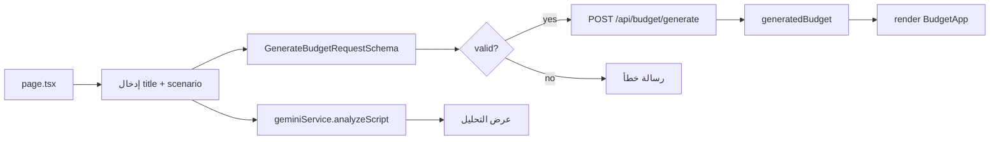

# توثيق تطبيق BUDGET (FilmBudget AI Pro)

**المسار:** `frontend/src/app/(main)/BUDGET/`  
**النوع:** تحليل سيناريو مالي + توليد ميزانية احترافية  
**نقطة الدخول:** `page.tsx` ثم `components/BudgetApp.tsx` بعد التوليد

---

## 1) ملخص سريع

تطبيق `BUDGET` بيشتغل على مرحلتين:

1. **مرحلة إدخال وتحليل** من `page.tsx`:
   - إدخال عنوان الفيلم والسيناريو
   - تحليل أولي بالذكاء الاصطناعي
   - توليد ميزانية عبر API
2. **مرحلة التحرير والإدارة** داخل `BudgetApp` بعد نجاح التوليد.

---

## 2) مسار التنفيذ

---

## 3) مكونات ومنطق أساسي

- `page.tsx`:
  - يدير State الإدخال
  - يستخدم Zod للتحقق
  - يفصل بين تبويب الإدخال وتبويب التحليل
  - يحمل `BudgetApp` و`ScriptAnalyzer` بشكل ديناميكي
- `components/BudgetApp.tsx`:
  - واجهة التحرير الفعلي للميزانية
  - إعادة حساب تلقائي (`recalculateBudget`)
  - أدوات عرض وتحليل وتصدير
- `lib/types.ts`:
  - تعريف أنواع الميزانية كاملة
  - مخططات Zod للتحقق
- `lib/constants.ts`:
  - قالب ميزانية احترافي شامل (ATL + Production + ...)
- `lib/geminiService.ts`:
  - توليد ميزانية من السيناريو
  - تحليل سيناريو إنتاجي
  - رسائل أخطاء واضحة عند غياب API key

---

## 4) طبقة الذكاء الاصطناعي

`GeminiService` بيوفر:
- `generateBudgetFromScript`
- `analyzeScript`
- `optimizeBudget`

وبيستخدم نموذج `gemini-2.0-flash-exp` مع ضبط response بصيغة JSON.

---

## 5) ملاحظات هندسية

- التحقق المسبق بالـ Zod قبل أي طلب API قلل حالات الخطأ.
- التحميل الديناميكي للمكونات الثقيلة بيحسن أول تحميل.
- فيه فصل جيد بين واجهة المستخدم وطبقة الذكاء الاصطناعي.

---

## 6) ملفات مرجعية مقروءة

- `frontend/src/app/(main)/BUDGET/page.tsx`
- `frontend/src/app/(main)/BUDGET/components/BudgetApp.tsx`
- `frontend/src/app/(main)/BUDGET/lib/geminiService.ts`
- `frontend/src/app/(main)/BUDGET/lib/types.ts`
- `frontend/src/app/(main)/BUDGET/lib/constants.ts`

---

**آخر تحديث:** 2026-02-15
