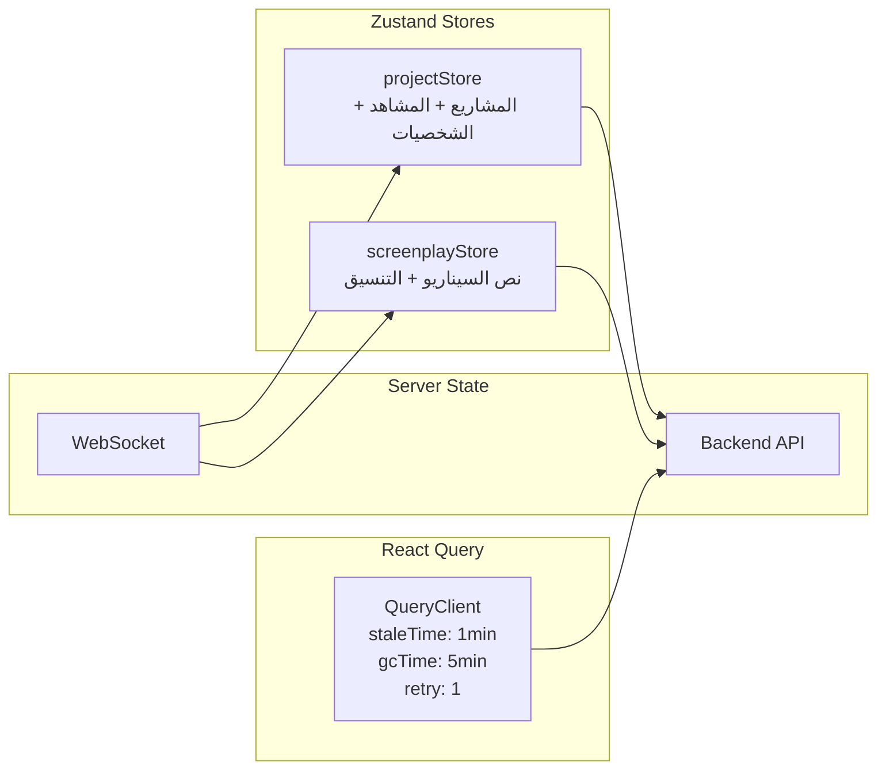
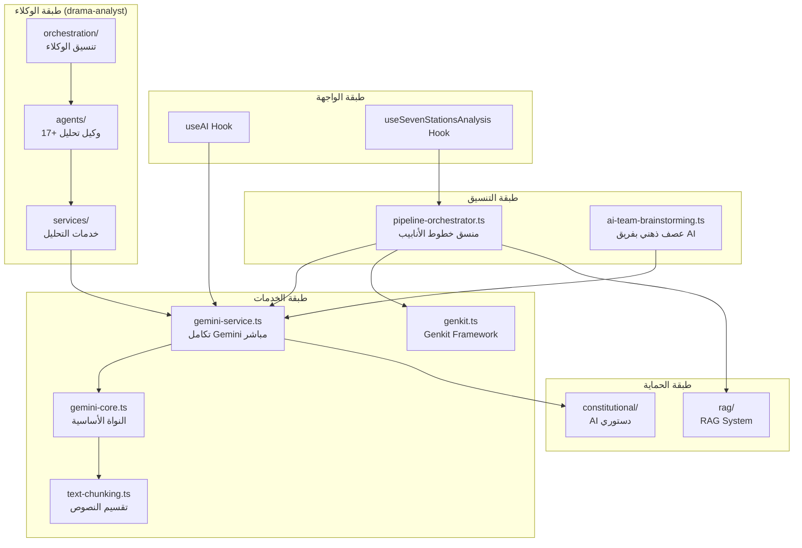

# توثيق الواجهة الأمامية (Frontend) — النسخة

**المسار:** `frontend/`  
**النوع:** Next.js 16 App Router + TypeScript  
**نقطة الدخول:** `src/app/layout.tsx`  
**المنفذ:** 5000

---

## 1. نظرة عامة

الواجهة الأمامية هي تطبيق Next.js 16 يعمل بنظام App Router، يوفر:
- **13 تطبيقاً متخصصاً** للإبداع السينمائي العربي
- **واجهة عربية كاملة** مع دعم RTL
- **نظام تحليل درامي** بـ 17+ وكيل ذكاء اصطناعي (frontend + backend)
- **محرر سيناريو احترافي** مع تنسيق ذكي
- **رسوم متحركة متقدمة** باستخدام GSAP + Three.js + Framer Motion
- **نظام مراقبة أداء** مع Sentry + OpenTelemetry + Web Vitals

---

## 2. البنية المعمارية

```mermaid
graph TB
    subgraph "طبقة التطبيق (App Layer)"
        LAYOUT[layout.tsx<br/>الجذر — RTL + Cairo Font]
        PROVIDERS[providers.tsx<br/>QueryClient + Notifications + Tracing]
        PAGE[page.tsx<br/>Landing Page]
    end

    subgraph "مجموعات المسارات (Route Groups)"
        AUTH["(auth)/<br/>تسجيل الدخول/التسجيل"]
        MAIN["(main)/<br/>التطبيقات الـ 13"]
        API["api/<br/>Server Actions"]
        UI_ROUTE["ui/<br/>مشغل التطبيقات المتقدم"]
    end

    subgraph "التطبيقات (13 تطبيق)"
        BREAKDOWN[breakdown/<br/>ScriptBreakdown AI]
        BUDGET[BUDGET/<br/>FilmBudget AI]
        EDITOR[editor/<br/>Screenplay Editor]
        DIRECTORS[directors-studio/<br/>Director's Studio]
        ART[art-director/<br/>CineArchitect AI]
        CINEFIT[new/<br/>CineFit Pro]
        ACTOR[actorai-arabic/<br/>ActorAI Studio]
        ANALYSIS[analysis/<br/>Seven Stations]
        CREATIVE[arabic-creative-writing-studio/]
        BRAINSTORM[brain-storm-ai/]
        CINEMA[cinematography-studio/]
        BREAKAPP[BREAKAPP/<br/>Runner Management]
        PROMPT[arabic-prompt-engineering-studio/]
    end

    subgraph "طبقة المنطق (Logic Layer)"
        HOOKS[hooks/<br/>11 Custom Hook]
        LIB_AI[lib/ai/<br/>Gemini + Genkit + Pipeline]
        LIB_DRAMA[lib/drama-analyst/<br/>17+ وكيل تحليل]
        STORES[lib/stores/<br/>Zustand Stores]
        SERVICES[lib/services/<br/>WebSocket Client]
    end

    subgraph "طبقة العرض (UI Layer)"
        COMP_UI[components/ui/<br/>shadcn/ui]
        COMP_ACE[components/aceternity/<br/>تأثيرات بصرية]
        COMP_LAND[components/landing/<br/>صفحة البداية]
        COMP_AUTH[components/auth/<br/>مكونات المصادقة]
        COMP_EDIT[components/editors/<br/>محررات]
        COMP_FIGMA[components/figma/<br/>مكونات Figma]
        COMP_SHARED[components/shared/<br/>مكونات مشتركة]
    end

    LAYOUT --> PROVIDERS --> PAGE
    LAYOUT --> AUTH & MAIN & API & UI_ROUTE
    MAIN --> BREAKDOWN & BUDGET & EDITOR & DIRECTORS & ART & CINEFIT
    MAIN --> ACTOR & ANALYSIS & CREATIVE & BRAINSTORM & CINEMA & BREAKAPP & PROMPT

    BREAKDOWN & ANALYSIS --> LIB_AI & LIB_DRAMA
    DIRECTORS --> STORES & HOOKS
    EDITOR --> HOOKS
    
    LIB_AI --> COMP_UI
    HOOKS --> SERVICES
    STORES --> SERVICES
```



---

## 3. هيكل المجلدات

```
frontend/
├── src/
│   ├── app/                              # Next.js App Router
│   │   ├── layout.tsx                    # الجذر — html[lang=ar dir=rtl] + Cairo Font
│   │   ├── page.tsx                      # Landing Page
│   │   ├── providers.tsx                 # QueryClient + NotificationProvider + Tracing
│   │   ├── error.tsx                     # Error Boundary
│   │   ├── global-error.tsx              # Global Error Handler
│   │   ├── loading.tsx                   # Loading UI
│   │   ├── fonts.ts                      # تعريف الخطوط
│   │   ├── globals.css                   # أنماط عامة
│   │   ├── revalidate.config.ts          # إعدادات ISR
│   │   │
│   │   ├── (auth)/                       # مجموعة المصادقة
│   │   │   ├── login/                    # صفحة تسجيل الدخول
│   │   │   └── register/                 # صفحة التسجيل
│   │   │
│   │   ├── (main)/                       # مجموعة التطبيقات الرئيسية
│   │   │   ├── ui/                       # مشغل التطبيقات المتقدم
│   │   │   │   ├── components/           # 17 مكون متقدم
│   │   │   │   │   ├── SevenStationsDock.tsx    # شريط المحطات السبع
│   │   │   │   │   ├── UniverseMap.tsx          # خريطة الكون الدرامي
│   │   │   │   │   ├── NarrativeTimeline.tsx    # الخط الزمني السردي
│   │   │   │   │   ├── CausalPlotGraph.tsx      # رسم الحبكة السببي
│   │   │   │   │   ├── DebateView.tsx           # عرض المناظرات
│   │   │   │   │   ├── RhythmMap.tsx            # خريطة الإيقاع
│   │   │   │   │   ├── ConfidenceMeter.tsx      # مقياس الثقة
│   │   │   │   │   ├── InspectorPanel.tsx       # لوحة الفحص
│   │   │   │   │   ├── TasksBoard.tsx           # لوحة المهام
│   │   │   │   │   ├── ExportHub.tsx            # مركز التصدير
│   │   │   │   │   ├── UploadDock.tsx           # شريط الرفع
│   │   │   │   │   ├── RadialCommandPalette.tsx # لوحة الأوامر الدائرية
│   │   │   │   │   ├── KeyboardShortcuts.tsx    # اختصارات لوحة المفاتيح
│   │   │   │   │   ├── AssetsShelf.tsx          # رف الأصول
│   │   │   │   │   ├── SceneCard.tsx            # بطاقة المشهد
│   │   │   │   │   ├── VersionsPanel.tsx        # لوحة الإصدارات
│   │   │   │   │   └── UniverseNode.tsx         # عقدة في خريطة الكون
│   │   │   │   ├── pages/                # صفحات فرعية
│   │   │   │   │   ├── AnalysisPage.tsx
│   │   │   │   │   ├── AssetsPage.tsx
│   │   │   │   │   ├── BrainstormPage.tsx
│   │   │   │   │   ├── DevelopmentPage.tsx
│   │   │   │   │   └── EditorPage.tsx
│   │   │   │   └── tokens/design-tokens.ts
│   │   │   │
│   │   │   ├── breakdown/               # ScriptBreakdown AI — تحليل بـ 12 وكيل
│   │   │   ├── BUDGET/                   # FilmBudget AI — ميزانية الإنتاج
│   │   │   ├── editor/                   # Screenplay Editor — محرر السيناريو
│   │   │   ├── directors-studio/         # Director's Studio — استوديو المخرج
│   │   │   ├── art-director/             # CineArchitect AI — تصميم الديكورات
│   │   │   ├── new/                      # CineFit Pro — تصميم الأزياء 3D
│   │   │   ├── actorai-arabic/           # ActorAI Studio — تدريب الممثلين
│   │   │   ├── analysis/                 # Seven Stations — المحطات السبع
│   │   │   ├── arabic-creative-writing-studio/  # استوديو الكتابة الإبداعية
│   │   │   ├── brain-storm-ai/           # عصف ذهني بالـ AI
│   │   │   ├── cinematography-studio/    # استوديو التصوير السينمائي
│   │   │   ├── BREAKAPP/                 # إدارة المساعدين (GPS Tracking)
│   │   │   ├── arabic-prompt-engineering-studio/ # هندسة التوجيهات
│   │   │   ├── apps-overview/            # نظرة عامة على التطبيقات
│   │   │   ├── metrics-dashboard/        # لوحة المقاييس
│   │   │   ├── styleIST/                 # أداة الأنماط
│   │   │   └── development/              # صفحة التطوير
│   │   │
│   │   ├── api/                          # API Routes (Server Actions)
│   │   └── __smoke__/                    # اختبارات الدخان
│   │
│   ├── components/                       # مكونات React المشتركة
│   │   ├── ui/                           # مكونات shadcn/ui (Radix UI)
│   │   ├── aceternity/                   # تأثيرات بصرية متقدمة
│   │   │   ├── background-beams.tsx
│   │   │   ├── card-spotlight.tsx
│   │   │   └── noise-background.tsx
│   │   ├── landing/                      # مكونات صفحة البداية
│   │   ├── auth/                         # مكونات المصادقة
│   │   ├── editors/                      # محررات متخصصة
│   │   ├── figma/                        # مكونات Figma-style
│   │   ├── shared/                       # مكونات مشتركة
│   │   └── providers/                    # مزودات السياق
│   │       └── notification-provider.tsx
│   │
│   ├── hooks/                            # React Hooks مخصصة
│   │   ├── useAuth.ts                    # إدارة المصادقة
│   │   ├── useAI.ts                      # تكامل الذكاء الاصطناعي
│   │   ├── useProject.ts                 # إدارة المشاريع
│   │   ├── useScreenplayEditor.ts        # محرر السيناريو
│   │   ├── useSevenStationsAnalysis.ts   # تحليل المحطات السبع
│   │   ├── useMetrics.ts                 # مقاييس الأداء
│   │   ├── usePerformanceDetection.ts    # كشف أداء الجهاز
│   │   ├── use-hero-animation.ts         # رسوم Hero المتحركة
│   │   ├── use-mobile.tsx                # كشف الأجهزة المحمولة
│   │   ├── use-notifications.ts          # الإشعارات
│   │   └── use-toast.ts                  # رسائل Toast
│   │
│   ├── lib/                              # مكتبات ومنطق مشترك
│   │   ├── ai/                           # خدمات الذكاء الاصطناعي
│   │   │   ├── gemini-service.ts         # تكامل Gemini AI المباشر
│   │   │   ├── gemini-core.ts            # النواة الأساسية لـ Gemini
│   │   │   ├── genkit.ts                 # تكامل Genkit Framework
│   │   │   ├── pipeline-orchestrator.ts  # منسق خطوط الأنابيب
│   │   │   ├── stations.ts              # تعريف المحطات السبع
│   │   │   ├── text-chunking.ts          # تقسيم النصوص الكبيرة
│   │   │   ├── ai-team-brainstorming.ts  # عصف ذهني بفريق AI
│   │   │   ├── dev.ts                    # أدوات التطوير
│   │   │   ├── constitutional/           # AI دستوري (Constitutional AI)
│   │   │   ├── core/                     # النواة (models + pipeline)
│   │   │   ├── flows/                    # تدفقات Genkit
│   │   │   ├── interfaces/               # واجهات
│   │   │   ├── rag/                      # RAG (Retrieval-Augmented Generation)
│   │   │   ├── services/                 # خدمات AI فرعية
│   │   │   ├── stations/                 # تنفيذ المحطات
│   │   │   └── utils/                    # أدوات مساعدة
│   │   │
│   │   ├── drama-analyst/                # نظام التحليل الدرامي
│   │   │   ├── index.ts                  # تصدير مركزي
│   │   │   ├── config.ts                 # إعدادات
│   │   │   ├── constants.ts              # ثوابت
│   │   │   ├── enums.ts                  # تعدادات
│   │   │   ├── types.ts                  # أنواع TypeScript
│   │   │   ├── agents/                   # وكلاء التحليل (17+ وكيل)
│   │   │   │   ├── adaptiveRewriting/
│   │   │   │   ├── analysis/
│   │   │   │   ├── audienceResonance/
│   │   │   │   ├── characterDeepAnalyzer/
│   │   │   │   ├── characterNetwork/
│   │   │   │   ├── characterVoice/
│   │   │   │   ├── completion/
│   │   │   │   ├── conflictDynamics/
│   │   │   │   ├── creative/
│   │   │   │   ├── culturalHistoricalAnalyzer/
│   │   │   │   ├── dialogueAdvancedAnalyzer/
│   │   │   │   ├── dialogueForensics/
│   │   │   │   ├── integrated/
│   │   │   │   ├── literaryQualityAnalyzer/
│   │   │   │   ├── platformAdapter/
│   │   │   │   ├── plotPredictor/
│   │   │   │   └── ... (المزيد)
│   │   │   ├── orchestration/            # تنسيق الوكلاء
│   │   │   └── services/                 # خدمات التحليل
│   │   │
│   │   ├── stores/                       # إدارة الحالة (Zustand)
│   │   │   ├── projectStore.ts           # حالة المشاريع
│   │   │   └── screenplayStore.ts        # حالة السيناريو
│   │   │
│   │   ├── services/                     # خدمات الاتصال
│   │   │   └── websocket-client.ts       # عميل WebSocket
│   │   │
│   │   ├── crypto/                       # تشفير (Zero-Knowledge)
│   │   ├── screenplay/                   # أدوات السيناريو
│   │   ├── search/                       # محرك البحث
│   │   ├── security/                     # أدوات الأمان
│   │   ├── types/                        # أنواع TypeScript مشتركة
│   │   ├── actions/                      # Server Actions
│   │   │
│   │   ├── api.ts                        # عميل API مركزي
│   │   ├── api-types.ts                  # أنواع API
│   │   ├── auth.ts                       # أدوات المصادقة
│   │   ├── firebase.ts                   # تكامل Firebase
│   │   ├── redis.ts                      # عميل Redis
│   │   ├── geminiService.ts              # خدمة Gemini مبسطة
│   │   ├── queryClient.ts               # إعدادات React Query
│   │   ├── projectStore.ts              # متجر المشاريع (legacy)
│   │   ├── constants.ts                  # ثوابت عامة
│   │   ├── utils.ts                      # أدوات مساعدة (cn, etc.)
│   │   ├── tracing.ts                    # OpenTelemetry Browser Tracing
│   │   ├── web-vitals.ts                 # Web Vitals tracking
│   │   ├── animations.ts                 # تعريفات الرسوم المتحركة
│   │   ├── hero-config.ts                # إعدادات Hero Section
│   │   ├── particle-system.ts            # نظام الجسيمات
│   │   ├── particle-letters.constants.ts # ثوابت حروف الجسيمات
│   │   ├── cdn.ts                        # أدوات CDN
│   │   ├── cache-middleware.ts           # وسيط التخزين المؤقت
│   │   ├── device-performance.ts         # كشف أداء الجهاز
│   │   ├── performance-detection.ts      # كشف الأداء
│   │   └── taskInstructions.ts           # تعليمات المهام
│   │
│   ├── ai/                               # Genkit AI (Server-Side)
│   ├── config/                           # إعدادات التطبيق
│   │   ├── apps.config.ts                # تعريف التطبيقات الـ 13
│   │   └── pages.manifest.json           # بيان الصفحات
│   │
│   └── styles/                           # أنماط CSS
│       └── globals.css
│
├── convex/                               # Convex Backend (Real-time DB)
├── public/                               # ملفات عامة (صور، أيقونات)
├── tests/                                # اختبارات E2E (Playwright)
├── reports/                              # تقارير الأداء
├── scripts/                              # سكربتات البناء والأداء
│
├── next.config.ts                        # إعدادات Next.js + Sentry + Bundle Analyzer
├── tailwind.config.ts                    # إعدادات Tailwind CSS
├── tsconfig.json                         # إعدادات TypeScript (strict)
├── vitest.config.ts                      # إعدادات Vitest
├── playwright.config.ts                  # إعدادات Playwright
├── eslint.config.js                      # إعدادات ESLint
├── postcss.config.mjs                    # إعدادات PostCSS
├── components.json                       # إعدادات shadcn/ui
├── lighthouserc.json                     # إعدادات Lighthouse CI
├── performance-budget.json               # ميزانية الأداء
└── build.config.js                       # إعدادات البناء
```

---

## 4. التطبيقات الـ 13

```mermaid
graph TB
    subgraph "إنتاج (Production)"
        A1["🎬 ScriptBreakdown AI<br/>/breakdown<br/>تحليل بـ 12 وكيل"]
        A2["👔 CineFit Pro<br/>/new<br/>أزياء 3D"]
        A3["📹 Cinematography Studio<br/>/cinematography-studio<br/>تخطيط اللقطات"]
    end

    subgraph "إبداعي (Creative)"
        B1["📝 Screenplay Editor<br/>/editor<br/>محرر احترافي"]
        B2["🎨 CineArchitect AI<br/>/art-director<br/>تصميم ديكورات"]
        B3["🎭 ActorAI Studio<br/>/actorai-arabic<br/>تدريب ممثلين"]
        B4["✍️ Creative Writing<br/>/arabic-creative-writing-studio"]
        B5["💡 Brain Storm AI<br/>/brain-storm-ai"]
        B6["⚡ Prompt Engineering<br/>/arabic-prompt-engineering-studio"]
    end

    subgraph "تحليل (Analysis)"
        C1["🧠 Seven Stations<br/>/analysis<br/>7 محطات تحليل"]
    end

    subgraph "إدارة (Management)"
        D1["🎥 Director's Studio<br/>/directors-studio<br/>إدارة مشاريع"]
        D2["💰 FilmBudget AI<br/>/BUDGET/app<br/>ميزانية"]
        D3["🏃 BreakApp<br/>/BREAKAPP<br/>GPS Tracking"]
    end

    A1 & C1 --> GEM[Gemini AI Service]
    D1 --> API[Backend API]
    B1 --> STORE[Zustand Store]
```



### تفاصيل كل تطبيق

| # | التطبيق | المسار | الفئة | الوصف |
|---|---------|--------|-------|-------|
| 1 | ScriptBreakdown AI | `/breakdown` | إنتاج | تحليل النصوص السينمائية بـ 12 وكيل متخصص |
| 2 | FilmBudget AI | `/BUDGET/app` | إدارة | إدارة ميزانية الإنتاج السينمائي |
| 3 | Screenplay Editor | `/editor` | إبداعي | محرر سيناريو احترافي مع دعم العربية |
| 4 | Director's Studio | `/directors-studio` | إدارة | مساحة عمل متكاملة لإدارة المشاريع |
| 5 | CineArchitect AI | `/art-director` | إبداعي | تصميم ديكورات سينمائية بالـ AI |
| 6 | CineFit Pro | `/new` | إنتاج | تصميم أزياء ثلاثية الأبعاد |
| 7 | ActorAI Studio | `/actorai-arabic` | إبداعي | أدوات تدريب وتطوير أداء الممثلين |
| 8 | Seven Stations | `/analysis` | تحليل | تحليل درامي متقدم عبر 7 محطات |
| 9 | Creative Writing | `/arabic-creative-writing-studio` | إبداعي | منصة كتابة إبداعية عربية |
| 10 | Brain Storm AI | `/brain-storm-ai` | إبداعي | توليد أفكار إبداعية بالـ AI |
| 11 | Cinematography Studio | `/cinematography-studio` | إنتاج | تخطيط وتحليل اللقطات |
| 12 | BreakApp | `/BREAKAPP` | إدارة | إدارة طلبات التصوير + GPS |
| 13 | Prompt Engineering | `/arabic-prompt-engineering-studio` | إبداعي | تطوير توجيهات AI بالعربية |

### روابط التوثيق التفصيلي للتطبيقات

- [Art Director (CineArchitect)](./art-director.md)
- [styleIST (CineFit Pro)](./styleIST.md)
- [Cinematography Studio (CineAI Vision)](./cinematography-studio.md)
- [Breakdown (Script Breakdown)](./breakdown.md)
- [BUDGET (FilmBudget AI Pro)](./BUDGET.md)
- [BREAKAPP](./BREAKAPP.md)
- [ActorAI Arabic](./actorai-arabic.md)
- [Arabic Creative Writing Studio](./arabic-creative-writing-studio.md)
- [Arabic Prompt Engineering Studio](./arabic-prompt-engineering-studio.md)
- [Brainstorm (Legacy)](./brainstorm.md)
- [Shared Hooks (Frontend)](./shared-hooks.md)

---

## 5. نظام إدارة الحالة (State Management)



- **Zustand:** للحالة المحلية المعقدة (مشاريع، سيناريو)
- **React Query:** للبيانات من الخادم مع تخزين مؤقت ذكي
- **WebSocket:** للتحديثات الفورية

---

## 6. نظام الذكاء الاصطناعي (Frontend AI)



---

## 7. نظام الرسوم المتحركة

| المكتبة | الاستخدام |
|---------|----------|
| **GSAP** | رسوم Landing Page المعقدة (V-Shape Animation, ScrollTrigger) |
| **Framer Motion** | انتقالات الصفحات ورسوم المكونات |
| **Three.js** | رسوم ثلاثية الأبعاد (CineFit Pro, Hero Section) |
| **@react-three/fiber** | تكامل Three.js مع React |
| **@react-three/drei** | أدوات مساعدة لـ Three.js |
| **tsparticles** | نظام الجسيمات في الخلفية |
| **Tailwind Animate** | رسوم CSS بسيطة |

---

## 8. إعدادات TypeScript

- **Target:** ES2022
- **Strict Mode:** مفعّل بالكامل (`strict: true`, `noImplicitAny`, `strictNullChecks`, إلخ)
- **Module:** ESNext مع Bundler Resolution
- **Path Aliases:**
  - `@/*` → `./src/*`
  - `@core/*` → `./src/lib/drama-analyst/*`
  - `@agents/*` → `./src/lib/drama-analyst/agents/*`
  - `@services/*` → `./src/lib/drama-analyst/services/*`
  - `@shared/*` → `./src/app/(main)/directors-studio/shared/*`

---

## 9. نظام الاختبارات

| النوع | الأداة | الأمر |
|-------|--------|-------|
| Unit Tests | Vitest | `pnpm test` |
| Coverage | @vitest/coverage-v8 | `pnpm test:coverage` |
| E2E | Playwright | `pnpm e2e` |
| Smoke Tests | Vitest | `pnpm test:smoke` |
| Accessibility | Playwright (@a11y) | `pnpm a11y:ci` |
| Performance | Playwright (@performance) | `pnpm perf:ci` |
| Lighthouse | @lhci/cli | `pnpm lighthouse` |

---

## 10. نظام الأداء والمراقبة

### مقاييس الأداء المستهدفة
- **FCP:** < 1.5 ثانية
- **LCP:** < 2.5 ثانية
- **FID:** < 100 مللي ثانية
- **CLS:** < 0.1

### أدوات المراقبة
- **Sentry:** تتبع الأخطاء + Performance Monitoring
- **OpenTelemetry:** Browser Tracing (يُفعّل في `providers.tsx`)
- **Web Vitals:** قياس Core Web Vitals
- **Lighthouse CI:** فحص الأداء في CI/CD
- **Performance Budget:** ميزانية أداء مع فحص تلقائي

### تحسينات الأداء المطبقة
- **ISR:** إعادة التحقق كل 24 ساعة (`revalidate = 86400`)
- **Code Splitting:** تقسيم تلقائي عبر App Router
- **Package Optimization:** `optimizePackageImports` لـ Radix UI + Lucide
- **Image Optimization:** Next.js Image مع remote patterns
- **CDN Support:** دعم CDN اختياري للملفات الثابتة
- **Compression:** gzip مفعّل
- **Cache Headers:** تخزين مؤقت طويل للملفات الثابتة

---

## 11. التبعيات الرئيسية

| التبعية | الإصدار | الغرض |
|---------|---------|-------|
| `next` | 16.1.5 | إطار عمل React |
| `react` | ^19.2.1 | مكتبة UI |
| `typescript` | ^5.7.2 | لغة البرمجة |
| `tailwindcss` | ^4.1.16 | أنماط CSS |
| `zustand` | ^5.0.8 | إدارة الحالة |
| `@tanstack/react-query` | ^5.90.10 | إدارة حالة الخادم |
| `@google/generative-ai` | ^0.24.1 | Gemini AI |
| `genkit` | ^1.25.0 | Genkit Framework |
| `gsap` | ^3.14.2 | رسوم متحركة |
| `three` | ^0.182.0 | رسوم 3D |
| `framer-motion` | ^12.23.26 | رسوم React |
| `@sentry/nextjs` | 10.32.1 | تتبع الأخطاء |
| `zod` | 3.25.76 | تحقق من البيانات |
| `firebase` | ^11.10.0 | Firebase SDK |
| `convex` | ^1.31.2 | Convex Backend |
| `recharts` | ^3.6.0 | رسوم بيانية |
| `lucide-react` | ^0.562.0 | أيقونات |

---

## 12. أوامر التشغيل

```bash
# التطوير
pnpm dev                    # تشغيل على المنفذ 5000

# البناء
pnpm build                  # بناء للإنتاج
pnpm build:production       # بناء مع إعدادات إنتاج صارمة

# الاختبارات
pnpm test                   # اختبارات الوحدة
pnpm test:coverage          # مع التغطية
pnpm e2e                    # اختبارات E2E
pnpm test:smoke             # اختبارات الدخان

# الجودة
pnpm lint                   # فحص ESLint
pnpm lint:fix               # إصلاح تلقائي
pnpm type-check             # فحص TypeScript
pnpm format                 # تنسيق Prettier

# الأداء
pnpm lighthouse             # فحص Lighthouse
pnpm budget:check           # فحص ميزانية الأداء
pnpm perf:analyze           # تحليل الأداء
pnpm analyze                # تحليل حجم الحزم
```

---

**آخر تحديث:** 2026-02-15
