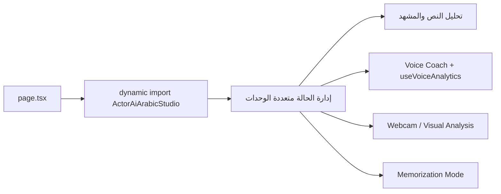

# توثيق تطبيق ActorAI Arabic

**المسار:** `frontend/src/app/(main)/actorai-arabic/`  
**النوع:** تدريب أداء الممثلين بالذكاء الاصطناعي  
**نقطة الدخول:** `page.tsx` → `components/ActorAiArabicStudio.tsx`

---

## 1) ملخص سريع

تطبيق `actorai-arabic` عبارة عن استوديو تدريبي متكامل للممثل، يجمع بين:
- تحليل النص والأهداف الدرامية
- شريك مشهد تفاعلي (Chat-based)
- التدريب الصوتي وتحليل الإلقاء
- تحليل بصري عبر الكاميرا
- أدوات AR/MR للمشهد والBlocking
- وضع حفظ النص والتلقين الذكي

---

## 2) مسار التنفيذ

---

## 3) المكونات والمنطق الأساسي

- `page.tsx`: تحميل ديناميكي للمكون الرئيسي مع fallback loading.
- `components/ActorAiArabicStudio.tsx`:
  - مركز إدارة الحالات (views + analysis + rehearsal + recording + AR)
  - دوال تنقل ومصادقة محلية ومحاكاة جلسات التدريب
  - منطق تحليلات متعددة (نص، إيقاع، كاميرا، حفظ)
- `components/VoiceCoach.tsx`:
  - واجهة التدريب الصوتي
  - رسم waveform حي على Canvas
  - ربط مباشر مع `useVoiceAnalytics`

---

## 4) Hooks وطبقات المساعدة

- `hooks/useVoiceAnalytics.ts`:
  - تحليل الصوت لحظيًا عبر Web Audio API
  - قياس Pitch / Volume / Speech Rate / Articulation
  - تتبع التنفس والوقفات الدرامية
- `hooks/useNotification.ts`:
  - إدارة إشعارات موحدة (success/error/info)
  - إخفاء تلقائي configurable
- Hooks إضافية داخل الوحدة:
  - `useMemorization.ts`
  - `useWebcamAnalysis.ts`

---

## 5) ملاحظات هندسية

- التصميم الحالي يعتمد state-heavy component داخل ملف رئيسي كبير.
- في فصل جيد لوحدات التحليل الحساسة عبر hooks مستقلة.
- التطبيق يستخدم محاكاة منطقية في أجزاء متعددة، مناسب لمرحلة prototyping المتقدم.

---

## 6) ملفات مرجعية مقروءة

- `frontend/src/app/(main)/actorai-arabic/page.tsx`
- `frontend/src/app/(main)/actorai-arabic/components/ActorAiArabicStudio.tsx`
- `frontend/src/app/(main)/actorai-arabic/components/VoiceCoach.tsx`
- `frontend/src/app/(main)/actorai-arabic/hooks/useVoiceAnalytics.ts`
- `frontend/src/app/(main)/actorai-arabic/hooks/useNotification.ts`

---

**آخر تحديث:** 2026-02-15
