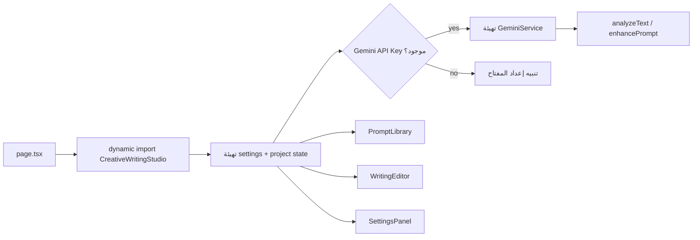

# توثيق تطبيق Arabic Creative Writing Studio

**المسار:** `frontend/src/app/(main)/arabic-creative-writing-studio/`  
**النوع:** ورشة كتابة إبداعية عربية مدعومة بالذكاء الاصطناعي  
**نقطة الدخول:** `page.tsx` → `components/CreativeWritingStudio.tsx`

---

## 1) ملخص سريع

التطبيق يقدم بيئة كتابة متكاملة تشمل:
- مكتبة محفزات (Prompt Library)
- محرر كتابة وتحليل نصوص
- إدارة مشاريع كتابة
- إعدادات تجربة الكتابة
- تكامل Gemini لتحليل النص وتحسين المحفزات

---

## 2) مسار التنفيذ

---

## 3) المكونات والمنطق الأساسي

- `page.tsx`: dynamic import بدون SSR لتخفيف أول تحميل.
- `components/CreativeWritingStudio.tsx`:
  - إدارة views: `home | library | editor | analysis | settings`
  - إدارة المشاريع (create/save/update/export)
  - إدارة إعدادات الكتابة والـ AI
  - lazy loading للمكونات الثقيلة
- المكونات الديناميكية الأساسية:
  - `PromptLibrary`
  - `WritingEditor`
  - `SettingsPanel`

---

## 4) طبقة الخدمات والأنواع

- `types/index.ts`:
  - تعريفات دقيقة للمحفزات، المشاريع، التحليل، والإعدادات
  - دعم عربي/إنجليزي + RTL/LTR
- `lib/data-manager.ts`:
  - إدارة البيانات المحلية للمشاريع (تخزين/استرجاع)
- `lib/gemini-service.ts`:
  - موصل خدمة Gemini الخاصة بالتطبيق

---

## 5) ملاحظات هندسية

- هيكل التطبيق modular نسبيًا مع فصل UI views عن منطق الإدارة.
- الاعتماد على lazy loading مناسب لحجم الواجهة الكبير.
- المنطق يضمن fallback واضح عند غياب إعداد Gemini API key.

---

## 6) ملفات مرجعية مقروءة

- `frontend/src/app/(main)/arabic-creative-writing-studio/page.tsx`
- `frontend/src/app/(main)/arabic-creative-writing-studio/components/CreativeWritingStudio.tsx`
- `frontend/src/app/(main)/arabic-creative-writing-studio/types/index.ts`
- `frontend/src/app/(main)/arabic-creative-writing-studio/lib/data-manager.ts`
- `frontend/src/app/(main)/arabic-creative-writing-studio/lib/gemini-service.ts`

---

**آخر تحديث:** 2026-02-15
