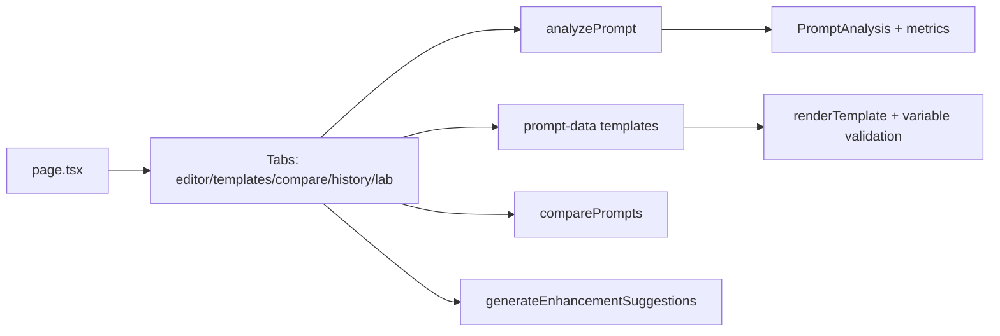

# توثيق تطبيق Arabic Prompt Engineering Studio

**المسار:** `frontend/src/app/(main)/arabic-prompt-engineering-studio/`  
**النوع:** تحليل وتحسين هندسة التوجيهات (Prompt Engineering)  
**نقطة الدخول:** `page.tsx`

---

## 1) ملخص سريع

التطبيق عبارة عن منصة هندسة توجيهات عربية بواجهات متعددة:
- محرر توجيهات مع تحليل فوري
- مكتبة قوالب قابلة للتخصيص
- مقارنة بين توجيهين
- سجل تاريخي للتوجيهات
- مختبر تجريبي

---

## 2) مسار التنفيذ

---

## 3) المكونات والمنطق الأساسي

- `page.tsx`:
  - إدارة state شامل (prompt, analysis, templates, history, comparison)
  - منطق التحليل والمقارنة عبر utilities محلية
  - واجهة dashboard كبيرة مبنية على Tabs + Cards + Progress
- `layout.tsx` / `loading.tsx`: دعم بنية Next App Router للتجربة.

---

## 4) طبقة التحليل والبيانات

- `lib/prompt-analyzer.ts`:
  - استخراج المقاييس النوعية للتوجيه
  - حساب overall score ونقاط القوة/الضعف
- `lib/prompt-data.ts`:
  - قوالب جاهزة وتصنيفها
  - توليد prompt من المتغيرات
  - التحقق من المدخلات المطلوبة
- `lib/gemini-service.ts`:
  - wrapper لخدمة Gemini
  - دوال estimate للـ token/cost
  - حماية واضحة ضد استدعاء التحليل المباشر client-side

---

## 5) ملاحظات هندسية

- التطبيق غني بالواجهة والتحليل المحلي، مناسب للتجارب السريعة دون round-trip ثقيل.
- فيه فصل ممتاز بين UI logic وPrompt logic داخل lib.
- تم توضيح حد أمني مهم: أي استدعاء AI مباشر لازم يمر عبر server action / API route.

---

## 6) ملفات مرجعية مقروءة

- `frontend/src/app/(main)/arabic-prompt-engineering-studio/page.tsx`
- `frontend/src/app/(main)/arabic-prompt-engineering-studio/lib/prompt-analyzer.ts`
- `frontend/src/app/(main)/arabic-prompt-engineering-studio/lib/prompt-data.ts`
- `frontend/src/app/(main)/arabic-prompt-engineering-studio/lib/gemini-service.ts`
- `frontend/src/app/(main)/arabic-prompt-engineering-studio/layout.tsx`

---

**آخر تحديث:** 2026-02-15
