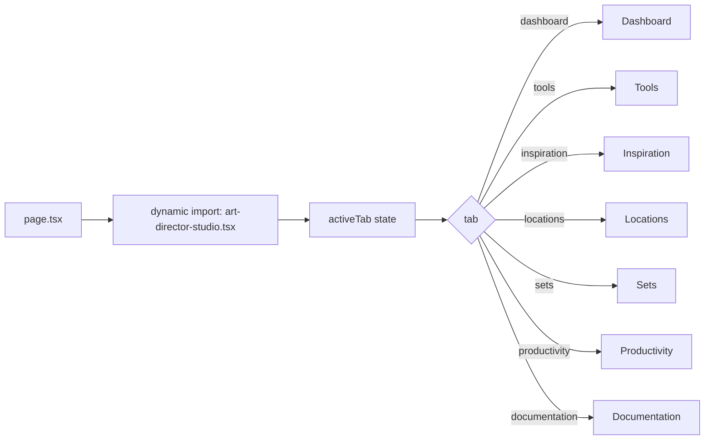

# توثيق تطبيق Art Director (CineArchitect)

**المسار:** `frontend/src/app/(main)/art-director/`  
**نوع التطبيق:** واجهة تصميم وإدارة فنية متعددة الأدوات  
**نقطة الدخول:** `page.tsx` → `art-director-studio.tsx`

---

## 1) ملخص سريع

التطبيق بيشتغل كـ Studio بواجهة جانبية Tabs، وكل Tab بيركّز على جزء مختلف من شغل مدير الفن:
- Dashboard
- Tools
- Inspiration
- Locations
- Sets
- Productivity
- Documentation

التحميل بيتم ديناميكيًا من `page.tsx` لتقليل الحمل الأولي.

---

## 2) مسار التنفيذ

---

## 3) مكونات أساسية

- `art-director-studio.tsx`: المكوّن الرئيسي وإدارة التنقل الجانبي.
- `components/Tools.tsx`: تشغيل الأدوات عبر endpoints ديناميكية بناءً على `toolConfigs`.
- `hooks/usePlugins.ts`: جلب قائمة plugins من `/api/plugins` مع fallback افتراضي.
- `core/toolConfigs` (مستخدم داخل Tools): تعريف المدخلات ونقطة التنفيذ لكل أداة.

---

## 4) نظام الـ Plugins

مجلد `plugins/` يحتوي 17 Plugin domain-specific، منها:
- `virtual-set-editor`
- `lighting-simulator`
- `location-coordinator`
- `budget-optimizer`
- `risk-analyzer`
- `documentation-generator`

> التطبيق بيعتمد على pattern مرن: أي Plugin جديد يقدر يدخل في تدفق التنفيذ طالما له config + endpoint.

---

## 5) ملاحظات هندسية

- في `usePlugins.ts` فيه fallback بيانات افتراضية لو `/api/plugins` فشل.
- في `Tools.tsx` التنفيذ موحّد عبر `fetch(config.endpoint)` بدل كتابة منطق مكرر لكل أداة.
- التصميم يوازن بين UI ثابت (Sidebar) ومحتوى متغيّر (Workspace).

---

## 6) ملفات مرجعية مقروءة

- `frontend/src/app/(main)/art-director/page.tsx`
- `frontend/src/app/(main)/art-director/art-director-studio.tsx`
- `frontend/src/app/(main)/art-director/components/Tools.tsx`
- `frontend/src/app/(main)/art-director/hooks/usePlugins.ts`

---

**آخر تحديث:** 2026-02-15
