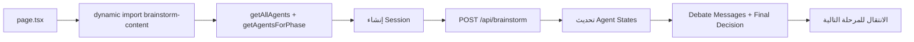

# توثيق تطبيق Brainstorm (Legacy)

**المسار:** `frontend/src/app/(main)/brainstorm/`  
**النوع:** منصة عصف ذهني متعددة الوكلاء (نسخة legacy)  
**نقطة الدخول:** `page.tsx` → `brainstorm-content.tsx`

---

## 1) ملخص سريع

تطبيق `brainstorm` يمثل نسخة legacy لمنصة العصف الذهني، ويحتوي على:
- إدارة جلسة إبداعية متعددة المراحل (5 مراحل)
- عرض وكلاء AI وحالاتهم
- تشغيل نقاش بين الوكلاء عبر API
- تتبع رسائل النقاش والقرار النهائي

> بحسب الجرد الحالي، النسخة دي مرشحة للمراجعة/الدمج مع `brain-storm-ai`.

---

## 2) مسار التنفيذ

---

## 3) المكونات والمنطق الأساسي

- `page.tsx`: صفحة تحميل ديناميكي مع fallback loading.
- `brainstorm-content.tsx`:
  - المكون الرئيسي لإدارة الجلسة والمراحل
  - إدارة حالات الوكلاء (idle/working/completed/error)
  - تنفيذ `executeAgentDebate` وربط نتيجة API بواجهة العرض
  - إدارة progress والمراحل
- `AgentCard` داخل نفس الملف:
  - عرض حالة كل وكيل
  - عرض قدرات الوكيل والمتعاونين

---

## 4) التكامل مع نظام الوكلاء

التطبيق يعتمد على registry مركزي:
- `@/lib/drama-analyst/services/brainstormAgentRegistry`
  - `getAllAgents`
  - `getAgentsForPhase`
  - `getAgentStats`

وده بيخليه واجهة تشغيل مباشرة لوكلاء متعددة بشكل visual واضح.

---

## 5) ملاحظات هندسية

- النسخة legacy لسه functional وتشتغل على نفس تصور multi-agent debate.
- منطق كبير مجمع داخل ملف واحد (`brainstorm-content.tsx`)؛ مناسب لمرحلة تجريبية.
- وجود نسخة أحدث (`brain-storm-ai`) يدعم قرار الدمج التدريجي أو الإحلال.

---

## 6) ملفات مرجعية مقروءة

- `frontend/src/app/(main)/brainstorm/page.tsx`
- `frontend/src/app/(main)/brainstorm/brainstorm-content.tsx`
- `frontend/src/lib/drama-analyst/services/brainstormAgentRegistry.ts`

---

**آخر تحديث:** 2026-02-15
