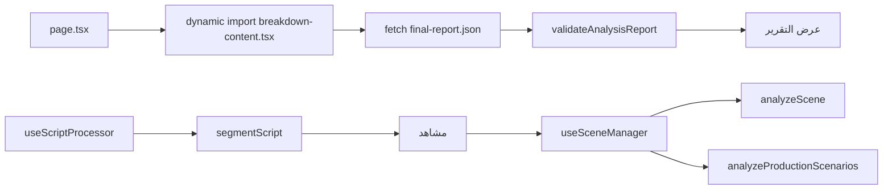

# توثيق تطبيق Breakdown (Script Breakdown)

**المسار:** `frontend/src/app/(main)/breakdown/`  
**النوع:** تحليل سيناريو + تفكيك مشاهد + سيناريوهات إنتاج  
**نقطة الدخول:** `page.tsx` → `breakdown-content.tsx`

---

## 1) ملخص سريع

تطبيق `breakdown` فيه مسارين واضحين داخل نفس الوحدة:

1. **مسار تقرير التحليل النهائي** عبر `breakdown-content.tsx`، وده بيقرأ ملف JSON جاهز من `/analysis_output/final-report.json`.
2. **مسار معالجة السيناريو وتفكيك المشاهد** عبر Hooks وخدمات Gemini داخل نفس المجلد (`hooks/` + `services/`).

الهدف إن المستخدم يقدر:
- يقسم السيناريو لمشاهد
- يحلل كل مشهد
- يشوف سيناريوهات إنتاج بديلة
- يحتفظ بإصدارات التحليل ويرجع لها

---

## 2) مسار التنفيذ

---

## 3) مكونات ومنطق أساسي

- `page.tsx`: تحميل ديناميكي للمحتوى (SSR مقفول لتحسين التحميل).
- `breakdown-content.tsx`: عرض تقرير نهائي مع تحقق Zod قبل العرض.
- `hooks/useScriptProcessor.ts`:
  - يتحقق من الإدخال
  - يستدعي `segmentScript`
  - يحول الاستجابة إلى `Scene[]`
- `hooks/useSceneManager.ts`:
  - إدارة حالة المشاهد
  - تحليل المشهد
  - تحليل سيناريوهات الإنتاج
  - نظام Versioning للاسترجاع
- `services/geminiService.ts`:
  - `segmentScript`
  - `analyzeScene` (cast + 11 agents بالتوازي)
  - `analyzeProductionScenarios`
  - `createChatSession`

---

## 4) طبقة الذكاء الاصطناعي

الخدمة مبنية حوالين `@google/genai`، وفيها:
- إدارة مفتاح API من أكتر من مصدر
- تخزين مؤقت لمثيل AI
- مسارات تحليل مختلفة حسب المهمة
- معالجة أخطاء موحدة عبر `logError`

---

## 5) ملاحظات هندسية

- في فصل ممتاز بين العرض والمنطق (Component vs Hooks vs Services).
- `Promise.all` مستخدم في `analyzeScene` لتقليل وقت التحليل.
- فيه اهتمام واضح بقابلية الاسترجاع عبر `versions` لكل مشهد.

---

## 6) ملفات مرجعية مقروءة

- `frontend/src/app/(main)/breakdown/page.tsx`
- `frontend/src/app/(main)/breakdown/breakdown-content.tsx`
- `frontend/src/app/(main)/breakdown/hooks/useScriptProcessor.ts`
- `frontend/src/app/(main)/breakdown/hooks/useSceneManager.ts`
- `frontend/src/app/(main)/breakdown/services/geminiService.ts`

---

**آخر تحديث:** 2026-02-15
