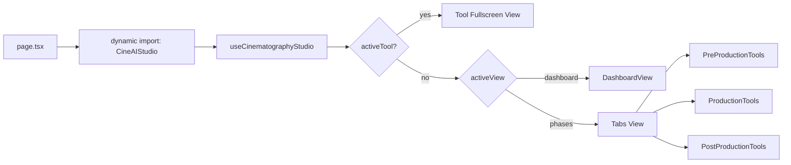

# توثيق تطبيق Cinematography Studio (CineAI Vision)

**المسار:** `frontend/src/app/(main)/cinematography-studio/`  
**نوع التطبيق:** منصة أدوات مدير التصوير عبر مراحل الإنتاج  
**نقطة الدخول:** `page.tsx` → `components/CineAIStudio.tsx`

---

## 1) ملخص سريع

التطبيق موجّه لمدير التصوير، ويجمع أدوات 3 مراحل:
- ما قبل الإنتاج
- أثناء التصوير
- ما بعد الإنتاج

مع وضعين عرض داخل نفس التطبيق:
- Dashboard (أدوات + بطاقات مراحل)
- Phases (Tabs حسب المرحلة)

---

## 2) إدارة الحالة

`useCinematographyStudio.ts` يدير الحالة بالكامل عبر `useReducer`:
- `currentPhase`
- `visualMood`
- `activeTool`
- `activeView`

مع دوال مهيكلة:
- `openTool / closeTool`
- `navigateToPhase`
- `handleTabChange`

---

## 3) الأدوات الديناميكية

داخل `CineAIStudio.tsx`، الأدوات الثقيلة تتحمّل ديناميكيًا مع `ssr: false`:
- `lens-simulator`
- `color-grading-preview`
- `dof-calculator`

وده بيقلل الـ initial bundle ويحسّن زمن التحميل.

---

## 4) مسار التنفيذ

---

## 5) ملاحظات هندسية

- التطبيق مصمم بنهج modular واضح: `components/`, `hooks/`, `types/`.
- فيه constants مركزية لتعريف الأدوات والإحصائيات ومراحل الإنتاج.
- React.memo مستخدم في المكونات الفرعية لتقليل rerender غير الضروري.

---

## 6) ملفات مرجعية مقروءة

- `frontend/src/app/(main)/cinematography-studio/page.tsx`
- `frontend/src/app/(main)/cinematography-studio/components/CineAIStudio.tsx`
- `frontend/src/app/(main)/cinematography-studio/hooks/useCinematographyStudio.ts`

---

**آخر تحديث:** 2026-02-15
