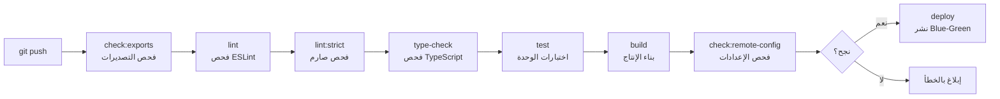

# توثيق السكربتات والأدوات — النسخة

**المسارات:**
- الجذر: `scripts/`
- Backend: `backend/scripts/`
- Frontend: `frontend/scripts/`

---

## 1. سكربتات الجذر (Monorepo)

### 1.1 أوامر التشغيل الرئيسية

| الأمر | السكربت | الوصف |
|-------|---------|-------|
| `pnpm start` | `scripts/start-app.ps1` | تشغيل التطبيق (PowerShell) |
| `pnpm stop` | `scripts/kill-ports.ps1` | إيقاف جميع الخدمات |
| `pnpm start:dev` | `start-dev.ps1` | تشغيل بيئة التطوير |
| `pnpm kill:dev` | `kill-dev.ps1` | إيقاف بيئة التطوير |
| `pnpm start:redis` | — | تشغيل Redis Server |
| `pnpm dev` | اختصار لـ `start:dev` | تشغيل التطوير |

### 1.2 أوامر الجودة والاختبار

| الأمر | الوصف |
|-------|-------|
| `pnpm lint` | فحص ESLint للـ Frontend |
| `pnpm lint:fix` | إصلاح تلقائي |
| `pnpm lint:strict` | فحص صارم |
| `pnpm test` | تشغيل اختبارات Frontend |
| `pnpm type-check` | فحص TypeScript (كل الحزم) |
| `pnpm build` | بناء Frontend للإنتاج |
| `pnpm smoke:tests` | اختبارات الدخان |

### 1.3 أوامر CI/CD

| الأمر | الوصف |
|-------|-------|
| `pnpm ci` | سلسلة CI الكاملة: exports → lint → type-check → test → build → remote-config |
| `pnpm check:exports` | فحص التصديرات المكررة |
| `pnpm check:exports:json` | فحص التصديرات (JSON output) |
| `pnpm check:exports:fix` | إصلاح التصديرات المكررة تلقائياً |
| `pnpm check:remote-config` | فحص إعدادات Remote Config |
| `pnpm approve-builds` | الموافقة على تحذيرات البناء |

### 1.4 أوامر متقدمة

| الأمر | الوصف |
|-------|-------|
| `pnpm audit:code` | تدقيق الكود (TypeScript script) |
| `pnpm workflow:ai` | تحليل سير العمل بالـ AI |

---

## 2. سكربتات المجلد `scripts/`

| الملف | النوع | الوصف |
|-------|-------|-------|
| `check-duplicate-exports.mjs` | Node.js | فحص وإصلاح التصديرات المكررة في الكود |
| `check-remote-config.mjs` | Node.js | التحقق من صحة إعدادات Remote Config |
| `builder-dev.mjs` | Node.js | أداة بناء بيئة التطوير |
| `workflow-ai-analysis.mjs` | Node.js | تحليل سير العمل باستخدام AI |
| `advanced-security-scan.sh` | Bash | فحص أمني متقدم |
| `security-scan.sh` | Bash | فحص أمني أساسي |
| `setup-git-secrets.sh` | Bash | إعداد git-secrets لمنع تسريب المفاتيح |
| `check-git-status.sh` | Bash | فحص حالة Git |
| `cleanup-untracked.sh` | Bash | تنظيف الملفات غير المتعقبة |
| `e2e-smoke-test.sh` | Bash | اختبارات E2E سريعة |
| `setup-ssl-certificates.sh` | Bash | إعداد شهادات SSL |
| `setup-production-infrastructure.sh` | Bash | إعداد البنية التحتية للإنتاج |
| `upload-to-cdn.sh` | Bash | رفع الملفات الثابتة إلى CDN |
| `deploy/blue-green-deploy.sh` | Bash | نشر Blue-Green (صفر توقف) |

---

## 3. سكربتات Backend

| الأمر | الوصف |
|-------|-------|
| `pnpm dev` | تشغيل مع إعادة تحميل تلقائي (tsc-watch) |
| `pnpm dev:mcp` | تشغيل خادم MCP |
| `pnpm build` | بناء TypeScript |
| `pnpm start` | تشغيل الإنتاج |
| `pnpm test` | اختبارات Vitest |
| `pnpm test:coverage` | اختبارات مع التغطية |
| `pnpm db:generate` | توليد هجرات Drizzle |
| `pnpm db:push` | تطبيق الهجرات |
| `pnpm db:studio` | فتح Drizzle Studio |
| `pnpm perf:setup` | إعداد قاعدة بيانات الأداء |
| `pnpm perf:seed` | بذر بيانات اختبار الأداء |
| `pnpm perf:baseline` | قياس أداء أساسي |
| `pnpm perf:apply-indexes` | تطبيق الفهارس |
| `pnpm perf:post-optimization` | قياس بعد التحسين |
| `pnpm perf:compare` | مقارنة نتائج الأداء |
| `pnpm logs:sanitize` | تنقية السجلات التاريخية من PII |
| `pnpm logs:sanitize:dry-run` | معاينة التنقية بدون تطبيق |

---

## 4. سكربتات Frontend

| الأمر | الوصف |
|-------|-------|
| `pnpm dev` | تشغيل Next.js على المنفذ 5000 |
| `pnpm build` | بناء للإنتاج |
| `pnpm start` | تشغيل نسخة الإنتاج |
| `pnpm test` | اختبارات Vitest |
| `pnpm test:coverage` | اختبارات مع التغطية |
| `pnpm e2e` | اختبارات Playwright |
| `pnpm e2e:ui` | اختبارات E2E مع واجهة |
| `pnpm lint` | فحص ESLint |
| `pnpm type-check` | فحص TypeScript |
| `pnpm format` | تنسيق Prettier |
| `pnpm lighthouse` | فحص Lighthouse CI |
| `pnpm budget:check` | فحص ميزانية الأداء |
| `pnpm perf:analyze` | تحليل الأداء |
| `pnpm perf:full` | تحليل أداء شامل (build + budget + analyze) |
| `pnpm analyze` | تحليل حجم الحزم (Bundle Analyzer) |
| `pnpm genkit:dev` | تشغيل Genkit في وضع التطوير |

---

## 5. أدوات التطوير (`dev-tools/`)

| المجلد | الوصف |
|--------|-------|
| `db-analysis/` | أدوات تحليل أداء قاعدة البيانات |

---

## 6. ملفات النشر (Deployment)

| الملف | الموقع | الوصف |
|-------|--------|-------|
| `Dockerfile` | `backend/` | حاوية Docker للـ Backend |
| `docker-entrypoint.sh` | `backend/` | نقطة دخول Docker |
| `Procfile` | `backend/` | إعدادات Heroku/Render |
| `render.yaml` | `backend/` | إعدادات Render.com |
| `.nginx/` | الجذر | إعدادات Nginx |

---

## 7. سير عمل CI/CD الكامل

---

**آخر تحديث:** 2026-02-15
